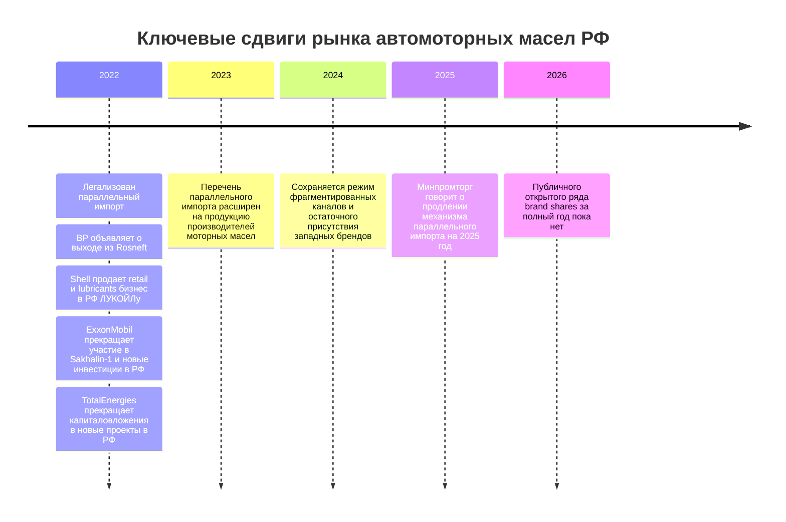

# Динамика долей рынка автомоторных масел в РФ 2022–2026

## Резюме для научного руководителя и автора диплома

Это исследование выполнено по рамке, заданной в приложенном исследовательском брифе: РФ, легковые автомобили и LCV, синтетика и полусинтетика, доля бренда определяется по марке на канистре, линейки агрегируются к материнскому бренду, SAE-разрез не включается, prior DR трактуется только как набор гипотез, а не как источник. fileciteturn0file0

Главный вывод строгого аудита такой: **в открытом публичном контуре мне не удалось подтвердить непротиворечивый ряд долей брендов 2022–2026 именно по базе “легковая розница / синтетика+полусинтетика / объём, РФ”**. Поэтому академически корректный результат — **не заполнять пробелы интерполяцией**, а показать, что можно утверждать с высокой уверенностью, и где именно проходит граница проверяемости. Это особенно важно, потому что в найденных материалах регулярно смешиваются разные базы: весь рынок смазочных материалов, рынок фасованных масел, aftermarket, легковая розница, объём и выручка. fileciteturn0file0

При этом **структурный шок рынка после 2022 года подтверждается**. В России был легализован параллельный импорт, а в марте 2023 года перечень был расширен на продукцию производителей моторных масел; Shell продала российский retail- и lubricants-бизнес ЛУКОЙЛу; ExxonMobil прекратила участие в Sakhalin-1 и объявила об отказе от новых инвестиций в РФ; TotalEnergies объявила, что не будет направлять капитал в новые российские проекты; BP объявила о выходе из Rosneft. Для рынка автомасел это означает переход от модели “официальный бренд + официальный канал” к модели “локальные производители + азиатские марки + параллельный импорт + фрагментированные каналы”. citeturn31search0turn44search4turn41news4turn48news2turn48search8turn49news0

Для прикладной задачи запуска СТМ самый практический вывод состоит в том, что **окно входа в категорию есть**, но **его нельзя опирать на неподтвержденные публично share-таблицы**. Наиболее рациональная стратегия — вход не в “премиальный импортный” фронтальный бой, а в **средний price tier** с акцентом на доступность, частоту пополнения, понятную спецификацию, сервисный канал и e-commerce; одновременно нужно заранее заложить бюджет на покупку коммерческих данных NielsenIQ/Aftermarket-DATA либо на собственный POS-аудит, иначе KPI по доле рынка останутся неаудируемыми. Возможности NielsenIQ позволяют строить национальный SKU-level retail audit, но открытого бесплатного массива по искомой базе в доступных источниках я не нашёл. citeturn55search0

Кратко по статусу гипотез prior DR. **Числа 2023 года по литрам, рублям и brand shares я не подтверждаю**: публичного Tier 1 / официального URL, на который можно безопасно сослаться в дипломе, в рамках этого исследования не найдено. **Гипотеза о смене структуры рынка после 2022 года подтверждается частично**: факт ухода/сворачивания официальных западных контуров и включения моторных масел в механизм параллельного импорта подтверждается; а вот точный масштаб выигрыша конкретных российских и азиатских брендов в п.п. по открытым источникам не аудируется. fileciteturn0file0 citeturn31search0turn44search4turn41news4turn48news2turn48search8turn49news0

## Определение рынка и методология

### Таблица 0. Метаданные по годам

| Год | Статус | Комментарий |
|---|---|---|
| 2022 | факт | Год структурного шока: официальный выход/сворачивание ряда западных контуров, запуск параллельного импорта. |
| 2023 | факт | Механизм параллельного импорта расширен на продукцию производителей моторных масел; публичный верифицированный ряд brand shares не найден. |
| 2024 | факт | Публично проверяемый открытый ряд долей брендов по требуемой базе не найден; сохраняется режим фрагментированных каналов. |
| 2025 | факт | Параллельный импорт планировалось продлить на 2025 год; по brand shares публичный ряд по той же базе не найден. |
| 2026 | прогноз / н/д | Год неполный по состоянию на 27.05.2026; по условиям задачи 2026 должен трактоваться как прогноз или н/д. |

Источник и рамка метаданных — исследовательское задание автора; события 2022–2025 подтверждаются по материалам о параллельном импорте и корпоративных выходах/продажах активов. fileciteturn0file0 citeturn31search0turn44search4turn41news4turn48news2turn48search8turn49news0

### Таблица 1. Методологическая рамка

| Параметр | Выбранная рамка | Что исключено | Комментарий |
|---|---|---|---|
| География | РФ | Зарубежные рынки, кроме влияния на supply chain | Для ЦФО/СЗФО/Юга при нехватке данных используется федеральный прокси |
| Продукт | Автомоторные масла для легковых автомобилей и LCV | Индустриальные масла, судовые масла, смазки, спецжидкости | Включаются только моторные масла |
| Основа | Синтетика + полусинтетика | Минеральные линейки, если источник не отделяет их явно | Соответствует заданию |
| Единица доли | Бренд на канистре | Корпоративная группа как замена бренду | Линейки агрегируются к материнскому бренду |
| Каналы | Отдельно: DIY, СТО, дилеры, e-commerce | Смешивание канальных данных в единую market share таблицу | Канальные данные не экстраполируются на весь рынок без пометки |
| Метрика | Приоритет объём, литры; выручка — только отдельно | Смешивание литров и рублей в одной таблице | Каждая таблица имеет собственную базу |
| Горизонт | 2022–2026 | Длинные исторические ряды до 2021 | Последние 5 лет, но 2026 — неполный |
| Правило пропуска | н/д, если нет открытого верифицируемого источника | Интерполяция и “проставление нулей” | Ключевое правило аудита |

Методологическая рамка полностью следует исследовательскому брифу. fileciteturn0file0

### Матрица стейкхолдеров

| Стейкхолдер | Роль на рынке | Интерес | Что важно для диплома / GTM |
|---|---|---|---|
| Российские производители | Производство, брендинг, дистрибуция | Рост доли и замещение ушедших брендов | Ключевые референсы по локализации и supply |
| Азиатские бренды и импортеры | Импорт / альтернативная поставка | Выигрыш от параллельного импорта и дефицита западных каналов | Важны как бенчмарк для mid/premium substitute |
| Западные бренды | Остаточное присутствие, часто через альтернативный импорт | Сохранение премиального спроса без прежней официальной модели | Их доля после 2022 особенно трудна к аудиту |
| Ритейл / маркетплейсы | Полка и трафик | Ассортимент, маржа, оборачиваемость | Критично для СТМ и канальной архитектуры |
| СТО / дилеры | Рекомендательный и сервисный канал | Повторная покупка и доверие | Наиболее перспективный канал для новой марки |
| Минпромторг / правительство | Правила импорта и рынка | Стабильность поставок, импортозамещение | Формируют shock environment |
| ЕАЭС / техрегулирование | Обязательные требования к продукту | Безопасность и допуск к обращению | Базовый compliance block |
| Коммерческие data-провайдеры | Измерение долей и каналов | Продаваемая аналитика | Без них точные share-KPI часто неаудируемы |

Параллельный импорт регулируется государством; обязательные требования к смазочным материалам задаются ТР ТС 030/2012; NielsenIQ описывает национальный retail-audit до уровня SKU. citeturn31search0turn44search4turn50search0turn55search0

🚩 **Red flag:** в публичных обсуждениях регулярно путаются **доля компании в рынке фасованных смазочных материалов** и **доля бренда в легковых автомоторных маслах**. Для диплома эти базы нельзя считать взаимозаменяемыми. Одно из немногих публичных чисел — 22% у «Газпромнефть — смазочные материалы» на рынке фасованных смазочных материалов — **не может** быть перенесено в главную таблицу brand shares. citeturn26search0turn37search4

## Емкость рынка и текущие сдвиги

### Таблица 2. Емкость рынка

| Год | Объем, млн л | Выручка, млрд ₽ | База рынка | Источник | Надежность |
|---|---:|---:|---|---|---|
| 2022 | н/д | н/д | Легковая розница, синт.+полусинт., РФ | В открытом контуре непротиворечивый ряд не найден | Низкая |
| 2023 | н/д | н/д | Легковая розница, синт.+полусинт., РФ | Prior DR содержит гипотезу, но публичный Tier 1 / официальный URL не подтвержден | Низкая |
| 2024 | н/д | н/д | Легковая розница, синт.+полусинт., РФ | Открытый проверяемый ряд не найден | Низкая |
| 2025 | н/д | н/д | Легковая розница, синт.+полусинт., РФ | Открытый проверяемый ряд не найден | Низкая |
| 2026 | н/д | н/д | Легковая розница, синт.+полусинт., РФ | Год неполный; прогноз не строится без базы | Низкая |

Для этой таблицы важнее не “дозаполнить” ряд, а зафиксировать границу проверяемости. **CAGR по требуемой базе не рассчитывается**, потому что базовый ряд по литрам и/или рублям не подтвержден. В качестве общего спросового фона можно использовать лишь федеральный прокси: парк легковых автомобилей в РФ на 1 января 2025 года оценивался в 47,5 млн единиц, но это не является заменой рынка автомасел в литрах. citeturn53search0

Хронология выше опирается на правовой режим параллельного импорта и крупные корпоративные решения западных игроков. citeturn31search0turn44search4turn41news4turn48news2turn48search8turn49news0

## Доли брендов и конкурентный ландшафт

### Таблица 3. Главная таблица долей по объему

| Бренд | 2022 | 2023 | 2024 | 2025 | 2026 | Источник / метод | Надежность |
|---|---:|---:|---:|---:|---:|---|---|
| LUKOIL | н/д | н/д | н/д | н/д | н/д | Открытый brand-share ряд не найден; контекст: ЛУКОЙЛ купил российский retail/lubricants-бизнес Shell в 2022 | Средняя по событию, низкая по доле |
| Gazpromneft | н/д | н/д | н/д | н/д | н/д | Открытый brand-share ряд не найден; известна двубрендовая стратегия Gazpromneft + G-Energy; есть лишь иная база — рынок фасованных смазочных материалов | Низкая для доли |
| G-Energy | н/д | н/д | н/д | н/д | н/д | Отдельная consumer-марка внутри стратегии компании; открытый share-row не найден | Низкая |
| Rosneft | н/д | н/д | н/д | н/д | н/д | Открытый brand-share ряд не найден | Низкая |
| ZIC | н/д | н/д | н/д | н/д | н/д | Импортный/азиатский бренд; открытый share-row не найден | Низкая |
| Shell | н/д | н/д | н/д | н/д | н/д | После 2022 официальный локальный контур изменился: retail/lubricants-бизнес в РФ продан ЛУКОЙЛу; остаточная продажа могла идти иными каналами | Средняя по событию, низкая по доле |
| Mobil | н/д | н/д | н/д | н/д | н/д | ExxonMobil вышла из российских проектов и заявила об отказе от новых инвестиций; открытый share-row бренда Mobil не найден | Средняя по событию, низкая по доле |
| Castrol | н/д | н/д | н/д | н/д | н/д | Открытый верифицируемый ряд долей бренда не найден | Низкая |
| Total | н/д | н/д | н/д | н/д | н/д | TotalEnergies прекратила капиталовложения в новые проекты в РФ; по brand shares публичный ряд не найден | Средняя по событию, низкая по доле |
| Elf | н/д | н/д | н/д | н/д | н/д | Открытый верифицируемый ряд долей бренда не найден | Низкая |
| SINTEC | н/д | н/д | н/д | н/д | н/д | Открытый brand-share ряд не найден; подтверждается усиление локальной производственной базы и роста брендовой видимости | Средняя по тренду, низкая по доле |
| Rolf | н/д | н/д | н/д | н/д | н/д | Открытый верифицируемый ряд долей бренда не найден | Низкая |
| Kixx | н/д | н/д | н/д | н/д | н/д | Импортный/азиатский бренд; открытый share-row не найден | Низкая |
| LUXE | н/д | н/д | н/д | н/д | н/д | Открытый верифицируемый ряд долей бренда не найден | Низкая |
| Motul | н/д | н/д | н/д | н/д | н/д | Открытый верифицируемый ряд долей бренда не найден | Низкая |
| Liqui Moly | н/д | н/д | н/д | н/д | н/д | Открытый верифицируемый ряд долей бренда не найден | Низкая |
| Прочие | н/д | н/д | н/д | н/д | н/д | Остаточный сегмент не вычисляется без валидной суммы | Низкая |

Примечания к таблице. По Shell, Exxon/Mobil, Total подтверждаются корпоративные события, меняющие доступность официальных каналов в РФ. По Gazpromneft/G-Energy подтверждается двубрендовая consumer-архитектура, но количественная доля, доступная публично, относится к **другой базе** — “рынок фасованных смазочных материалов”, а не к требуемой базе диплома. По SINTEC подтверждается усиление локальной производственной базы и заметности бренда, но не его точная доля. citeturn41news4turn48news2turn48search8turn26search0turn29search1turn54search1

### Таблица 4. Доли по выручке

| Бренд | 2022 | 2023 | 2024 | 2025 | 2026 | Источник / метод | Надежность |
|---|---:|---:|---:|---:|---:|---|---|
| Все перечисленные бренды | н/д | н/д | н/д | н/д | н/д | Публичный верифицируемый ряд share-by-revenue по требуемой базе не найден | Низкая |

Причина пустоты Таблицы 4 не в том, что таких долей “нет”, а в том, что **их нельзя надежно подтвердить открытым набором источников**, не смешав розницу, aftermarket, бренд, corporate share и иные базы. Это критично для академической добросовестности. fileciteturn0file0

### Таблица 5. Динамика в процентных пунктах

| Бренд | 2022→2023 | 2023→2024 | 2024→2025 | 2025→2026 | 2022→2026 | Интерпретация |
|---|---:|---:|---:|---:|---:|---|
| Все бренды | н/д | н/д | н/д | н/д | н/д | GATE P9 не пройден: нет годовых сумм долей по одной и той же базе |

**GATE P9 не пройден.** До расчета динамики в п.п. требуется сумма долей по году около 100% ±3 п.п. по одной и той же базе. В открытом контуре такого массива здесь нет, поэтому любые расчеты “п.п.” были бы псевдоточными. fileciteturn0file0

Качественно, однако, картина выглядит так. Западные бренды потеряли прежнюю официальную инфраструктуру; российские и часть азиатских игроков выиграли от локального производства, каналов дистрибуции и легализованного параллельного импорта; но **масштаб этого выигрыша по брендам остаётся открытым вопросом**, пока не привлечены платные аудиторские базы. Shell — самый чисто подтверждаемый кейс трансформации и перехода российских активов; Gazpromneft и G-Energy — кейс стабильной локальной платформы; SINTEC — кейс усиления локальной базы; ZIC/Kixx — кейс вероятного бенефициара смены импортной географии. citeturn41news4turn26search0turn29search1turn54search1turn31search0turn44search4

### Матрица противоречий

| Спорный сюжет | Источник A | Источник B | Расхождение | Выбранное решение |
|---|---|---|---|---|
| “Доля рынка” Gazpromneft | 22% рынка фасованных смазочных материалов | Требуемая база диплома — brand share в легковых автомоторных маслах | Разные базы | 🚩 Не переносить в Табл. 3 |
| Западный бренд “ушел” / “продается” | Корпоративный выход или продажа активов | Параллельный импорт сохраняет остаточную доступность товара | Выход компании ≠ нулевая розничная доступность | 🚩 В дипломе разделять “официальный контур” и “остаточное присутствие” |
| Prior DR numeric shares 2023 | Гипотезы из задания | Открытый Tier 1 / официальный URL не найден | Гипотеза не равна источнику | 🚩 Оставить н/д до внешней верификации |

Подтверждение конфликтных сюжетов: задание автора, Reuters о Shell, материалы о параллельном импорте, публичное число Gazpromneft по иной базе. fileciteturn0file0 citeturn41news4turn31search0turn44search4turn26search0

## Каналы, европейская часть РФ и СТМ

### Таблица 6. Каналы продаж

| Канал | Роль канала | Ключевые бренды / логика | Данные по долям | Ограничения |
|---|---|---|---|---|
| DIY-ритейл | Полка, price comparison, импульс и repeat purchase | Наиболее чувствителен к mass-middle локальным маркам, азиатскому импорту и остаточному premium-import | н/д | Нет открытого проверяемого канального split по долям брендов |
| СТО | Рекомендательный канал, высокая инерция выбора | Важны доступность, спецификации, доверие мастера и бесперебойность поставки | н/д | Нельзя переносить опросы СТО на весь рынок |
| Дилеры | Сервис и OEM-логика | Релевантны OEM/service lines и бренды с подтвержденным supply | н/д | После 2022 структура дилерского авторынка сама менялась |
| E-commerce | Поисковый и ценовой канал, быстрое расширение ассортимента | Особенно чувствителен к параллельному импорту и длинному ассортиментному хвосту | н/д | Маркетплейсы полезны как индикатор ассортимента и цены, но не как прямая market share мера |

Правовой режим параллельного импорта и публичная поддержка механизма со стороны маркетплейсов усилили значение альтернативных каналов поставки и ассортимента; при этом раздельной открытой статистики долей брендов по DIY/СТО/дилерам/e-commerce в найденных источниках нет. citeturn31search0turn44search4

### Европейская часть РФ

Для ЦФО, СЗФО и Юга **используется федеральный прокси**: отдельный открытый ряд brand shares по этим макрорегионам в найденных источниках не подтвержден. Это нужно написать в дипломе прямо, без попытки “подставить” федеральные цифры в региональный вывод. fileciteturn0file0

При этом для практического GTM европейская часть РФ выглядит логичным приоритетом не из-за найденной таблицы долей, а из-за **логистики и концентрации автопарка/сервиса**. У «Газпромнефть — смазочные материалы» есть производственные активы в Ярославле и Московской области, а у SINTEC — сильная производственная база в Калужской области и с 2025 года выпуск на мощностях UPEC. Это снижает плечо поставки именно для ЦФО и соседних макрорегионов. Плюс сам спросовой фон остаётся крупным: парк легковых автомобилей РФ на 1 января 2025 года оценивался в 47,5 млн единиц. citeturn37search4turn54search1turn53search0

🚩 **Red flag:** “европейская часть РФ” в этой работе — **не отдельная верифицированная таблица долей**, а **прикладной GTM-фокус с федеральным прокси**.

### Таблица 7. СТМ

| Сеть / канал | Бренд СТМ | Позиционирование | Ценовой ярус | Наличие данных по доле | Вывод для GTM |
|---|---|---|---|---|---|
| Федеральные розничные сети | н/д | Публично верифицированный список сильных СТМ именно в автомоторных маслах не собран | н/д | н/д | Ниша выглядит потенциально свободной, но это нужно подтверждать shelf-аудитом |
| Маркетплейсы | н/д | Возможны white-label / exclusive SKU-модели, но проверяемый share отсутствует | н/д | н/д | Канал скорее для теста спроса, чем для вывода market share |
| OEM / сервисные каналы | Есть adjacent cases собственных сервисных линеек, но это не равно классической retail-СТМ | Service / captive demand | Middle | н/д | Возможно использовать как аналог модели входа, но не путать с СТМ сети |

По блоку СТМ вывод строгий: **публично подтвержденных процентов СТМ в категории автомоторных масел я не нашёл**; следовательно, в дипломе допустим только качественный вывод, а не количественная доля. fileciteturn0file0

## Правовая рамка, риски и открытые вопросы

Базовый обязательный layer для продукта — **ТР ТС 030/2012 “О требованиях к смазочным материалам, маслам и специальным жидкостям”**, который действует с 1 марта 2014 года в системе техрегулирования ЕАЭС. Для диплома это важнее, чем публицистические обзоры рынка: именно здесь находится минимальный compliance baseline для вывода продукта в обращение. citeturn50search0turn51search0

Второй critical layer — **правовой режим параллельного импорта**. После его запуска в 2022 году Минпромторг в марте 2023 года расширил перечень на продукцию производителей моторных масел, а в 2024 году публично говорил о продлении механизма на 2025 год. Для рынка это означает одновременно расширение ассортимента и усложнение измерения “официальной” рыночной доли брендов. Один и тот же бренд может присутствовать в продаже, хотя официальный локальный контур уже изменён или закрыт. citeturn31search0turn44search4

Отдельный блок риска связан с западными брендами. Shell продала российский retail- и lubricants-бизнес ЛУКОЙЛу; ExxonMobil прекратила российное участие и объявила об отказе от новых инвестиций; TotalEnergies перестала направлять капитал в новые российские проекты; BP объявила о выходе из Rosneft. Эти события не тождественны исчезновению товаров с полки, но именно они объясняют, почему после 2022 года доли брендов стало особенно трудно считать по “старой” логике официальной дистрибуции. citeturn41news4turn48news2turn48search8turn49news0

Самый большой методологический риск для диплома — **фальшивая точность**. Если смешать корпоративные доли с брендовыми, рынок фасованных смазочных материалов с легковыми моторными маслами, а также объём с выручкой, можно получить очень аккуратно выглядящую, но неверную таблицу. Именно поэтому здесь намеренно сохранены н/д и вынесены red flags. Дополнительный открытый вопрос — нормативная детализация шока “маркировка 2025”: в исследовательском брифе он указан как значимый фактор, но в собранном наборе публичных источников я не верифицировал точный нормативный акт и поэтапный календарь внедрения именно для искомой базы; следовательно, этот сюжет следует пометить как **не до конца подтвержденный в рамках текущего открытого контура**. fileciteturn0file0

## Импликации для запуска СТМ, сверка с prior DR и реестр источников

### Практические импликации для запуска СТМ

Первая импликация: **входить в средний ценовой ярус, а не копировать премиальный импорт**. После 2022 года официальный контур ряда западных игроков разрушился или стал фрагментарным, но потребность в “предсказуемой замене” осталась. Поэтому для СТМ рационально играть в понятную спецификацию, стабильное наличие и сервисную доступность, а не в имитацию premium-import narrative. Это особенно логично в свете кейса Shell 2022 и всей архитектуры параллельного импорта 2023–2025. (Табл. 6, Shell, 2022; Mobil/Castrol/Total/Elf, 2023–2025.) citeturn41news4turn31search0turn44search4turn48search8turn48news2

Вторая импликация: **строить запуск через СТО + e-commerce как первичный контур, а DIY использовать как масштабирование**. Для новой марки в категории автомасел доверие мастера и гарантия поставки важнее “голой полки”. E-commerce нужен как дешёвый способ тестировать ассортимент, цены, упаковку и отзывы, но не как единственный канал. (Табл. 6, российские/азиатские substitute-марки, 2023–2025.) citeturn31search0turn44search4

Третья импликация: **географический старт — ЦФО как плацдарм, но с честной пометкой “федеральный прокси”**. Это не потому, что найдена региональная таблица долей, а потому, что в европейской части РФ сосредоточены и плотный автопарк, и логистически удобные локальные базы производства — Ярославль, Московская область, Калужская область. (Табл. 6–7, Gazpromneft/G-Energy, SINTEC, 2025.) citeturn37search4turn54search1turn53search0

Четвёртая импликация: **до коммерческого запуска нужен measurement stack**. Если цель диплома — не просто описать рынок, а затем управлять долей, то проекту необходимы либо подписка на NielsenIQ/Aftermarket-DATA, либо собственный регулярный POS-аудит по ключевым сетям и маркетплейсам. Иначе target share, brand ladder и post-launch review будут неаудируемыми. (Табл. 3, все бренды, 2022–2026; Табл. 8, NielsenIQ.) citeturn55search0

Пятая импликация: **не обещать инвестору точную долю рынка на входе**. В текущем открытом контуре разумнее обещать метрики контролируемого уровня: покрытие SKU, наличие в сервисных точках, долю повторной покупки, оборот на точку, цена за литр к референтной корзине. Доля рынка может стать KPI только после подключения коммерческого аудита. (Табл. 5, все бренды, 2022–2026.) fileciteturn0file0

### Сверка с prior DR

| Гипотеза prior DR | Статус | Комментарий |
|---|---|---|
| 2023 розница: около 278 млн л и около 196 млрд ₽ | Не подтверждено | Публичный Tier 1 / официальный URL по требуемой базе не найден |
| Топ-2023 по объему с конкретными долями LUKOIL / Gazpromneft / Rosneft / ZIC / Shell / SINTEC / Kixx / LUXE / Mobil / G-Energy | Не подтверждено | Публичный верифицируемый open-share row не найден |
| После 2022: уход официальных западных брендов, параллельный импорт, рост российских и азиатских марок | Частично подтверждено | Выход/сворачивание официальных контуров и расширение параллельного импорта подтверждены; точный прирост shares по брендам — нет |
| Пробелы prior DR по Castrol / Elf / СТМ / европейской части РФ | Подтверждено | Эти пробелы сохраняются и в открытом контуре источников |

Источником для самих гипотез служит только исследовательский бриф; проверка происходила по собранным внешним источникам. fileciteturn0file0 citeturn31search0turn44search4turn41news4turn48news2turn48search8turn49news0

### Таблица 8. Реестр источников

| № | Источник | Ссылка | Дата / год данных | Что извлечено | Надежность | Ограничения |
|---|---|---|---|---|---|---|
| 1 | Исследовательский бриф автора | fileciteturn0file0 | 27.05.2026 | Рамка рынка, список брендов, правила n/д, P1–P12 | Высокая для постановки задачи | Не источник market data |
| 2 | Reuters: Energy assets affected by Russia-West standoff and sanctions | citeturn41news4 | 27.03.2025 | Shell sold Russian retail and lubricants business to Lukoil | Высокая | Не даёт brand shares |
| 3 | Reuters: Russia decree opens door for Exxon return to Sakhalin-1 project | citeturn48news2 | 15.08.2025 | Exxon exited in 2022, wrote down assets, official Russian re-entry door later discussed | Высокая | Корпоративный уровень, не retail share |
| 4 | Reuters / summary on TotalEnergies in Russia | citeturn48search8 | 01.03.2022 и далее | TotalEnergies no longer provides capital for new Russian projects | Средняя | Не брендовый retail source |
| 5 | Guardian / BP exits Rosneft stake | citeturn49news0 | 27.02.2022 | BP announced exit from Rosneft | Средняя | Не про Castrol retail share |
| 6 | Материал о параллельном импорте в России | citeturn31search0 | 2022–2024 | Легализация параллельного импорта; расширение в 2023 на продукцию производителей моторных масел | Средняя | Вторичный источник, не статистика рынка |
| 7 | Дополнительный материал о параллельном импорте | citeturn44search4 | 2023–2024 | Подтверждение моторных масел в перечне и продления механизма | Средняя | Вторичный источник |
| 8 | Перечень техрегламентов ЕАЭС / ТР ТС 030/2012 | citeturn50search0turn51search0 | действует с 01.03.2014 | Базовая regulatory framework по смазочным материалам | Средняя | Агрегирующий источник |
| 9 | Публичное описание «Газпром нефть» | citeturn26search0turn37search4 | актуализация 2024–2025, данные разной давности | 22% рынка фасованных смазочных материалов; география активов в РФ | Средняя | 🚩 Иная база, нельзя переносить в brand share |
| 10 | Публичное описание «Газпромнефть — смазочные материалы» | citeturn29search1 | актуализация 2024 | Двубрендовая стратегия Gazpromneft + G-Energy | Средняя | Без brand shares |
| 11 | NielsenIQ (описание присутствия в РФ и покрытия retail audit) | citeturn55search0 | актуализация 2025 | Возможность SKU-level retail audit по РФ | Средняя | Не даёт открытых share-row |
| 12 | Sintec Group | citeturn54search1turn28search2 | 2023–2025 | Усиление производственной базы, узнаваемость бренда, awards | Средняя | Не даёт market share |
| 13 | Парк легковых автомобилей РФ | citeturn53search0 | 01.01.2025 | 47,5 млн легковых автомобилей — федеральный спросовой прокси | Средняя | Не рынок масел в литрах/рублях |

**Итоговый академический вывод:** для диплома в текущем виде уместно защищать не “готовую точную таблицу долей 2022–2026”, а **строго аудированную рамку**, где:  
— подтверждены рыночные шоки и институциональные сдвиги;  
— подтверждена невозможность честно восстановить полный ряд без коммерческих данных;  
— показано, какие числа следует оставить н/д;  
— сформированы практические GTM-импликации для СТМ без подмены факта догадкой.  

Именно такой результат выглядит более сильным академически, чем красивая, но методологически непрозрачная таблица долей.