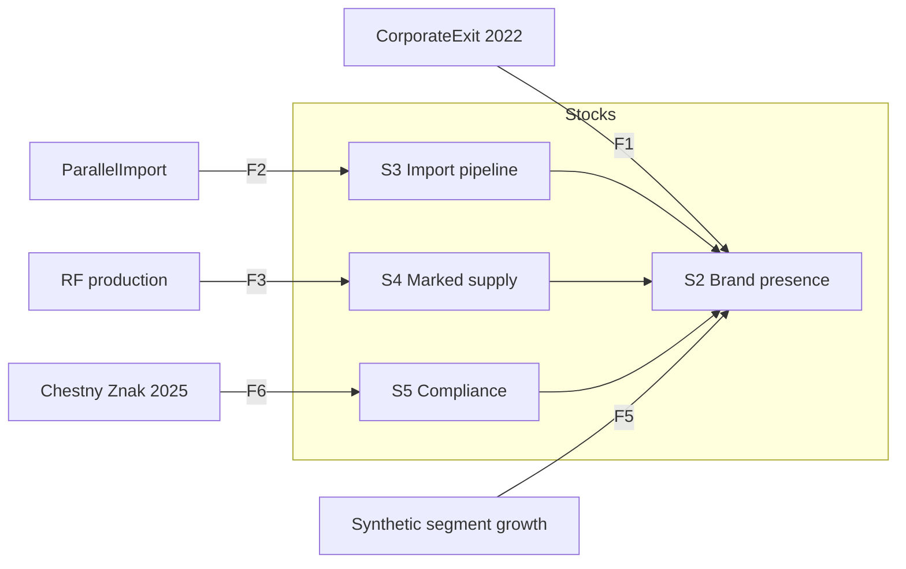
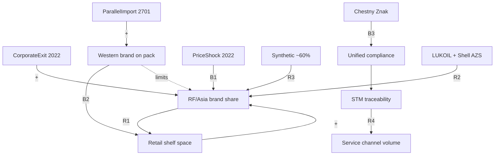

# Декомпозиция DR-A · Инструмент 5: Systems Thinking · Задача 1

**Инструмент:** Systems Thinking (системное мышление: границы, петли, запасы/потоки, рычаги)  
**Основа:** MECE D0, ER T1 (`07_ER_*`), GQM T1, `A_канон_диплом.md`  
**Дата:** 16.06.2026 · **Статус:** ✅ T1

**Назначение:** показать **динамику рынка как систему** — не статичные доли, а цепочки причин, обратные связи и точки воздействия для СТМ. Дополняет ER (структура) и GQM (метрики).

---

## 1. Граница системы (System Boundary)

```
┌─────────────────────────────────────────────────────────────────┐
│  СИСТЕМА: «Рынок автомасел РФ (легковые+LCV), 2022–2026»        │
│                                                                 │
│  Внутри: Brand, Operator, ImportFlow, ComplianceContour,        │
│          retail/aftermarket измерения, СТМ-кейсы                │
│                                                                 │
│  Снаружи: SAE/вязкости (DR-B), PGMM, грузовые масла,            │
│           глобальные цены нефти (контекст, без модели)          │
└─────────────────────────────────────────────────────────────────┘
```

| Элемент | В системе? | Артефакт |
|---------|:----------:|----------|
| Доли брендов S2/V1 | ✅ | §3.3–3.4 |
| Параллельный импорт + ЧЗ | ✅ | §3.9 |
| СТМ AGR/MZD | ✅ | §3.9.4, §4 |
| Channel-share DIY/СТО | 🟡 качеств. | n/д % |
| SAE 5W-30 vs 0W-20 | ❌ | DR-B |

---

## 2. Запасы и потоки (Stocks & Flows)

**Запасы (Stocks)** — накапливаемые величины; **потоки (Flows)** — скорости изменения.

| Stock | Что накапливает | Измерение (канон) | § |
|-------|-----------------|-------------------|---|
| **S1 Retail volume** | Объём на полке | 278 млн л (2023) | 3.2 |
| **S2 Brand presence** | Видимость марки (share) | S2 % л; NL-01 proxy | 3.3, 3.4.1 |
| **S3 Import pipeline** | Таможенный поток | AS-03 топ-импортёры | 3.6 |
| **S4 Domestic marked supply** | Отеч. + импорт в ЧЗ | CZ-01 81/19 ед. | 3.6 |
| **S5 Compliance readiness** | Доля SKU в контуре 030+ЧЗ | MK-05 календарь | 3.9 |
| **S6 Service-STM footprint** | Охват СТМ в сервисе | AGR 500+ тыс. л | 3.9.4 |

| Flow | From → To | Событие / драйвер |
|------|-----------|-------------------|
| **F1** | Ops exit → S2 Brand presence | CorporateExit 2022 (D0) |
| **F2** | Parallel import → S3 → S2 | Brand persistence (D3) |
| **F3** | RF production → S4 → S2 | Локализация (CZ-01) |
| **F4** | Price shock → переключение спроса | AS-05 2022 |
| **F5** | Synthetic growth → концентрация лидеров | NL-01 ~60% |
| **F6** | ЧЗ → S5 → барьер для «серого» | 01.09.2025 |



---

## 3. Петли обратной связи (Causal Loop Diagram)

### 3.1. Усиливающие петли (R)

| ID | Петля | Механизм | ER / MECE |
|----|-------|----------|-----------|
| **R1** | **Exit → vacuum → RF/Asia gain** | Уход ops западных → освобождение полки → LUKOIL, SINTEC, ZIC (+V1 p.p.) | D0, R6+R7 |
| **R2** | **Shell assets → LUKOIL integration** | 411 АЗС Shell → ЛУКОЙЛ → усиление дистрибуции лидера | D2, SH-02 |
| **R3** | **Synthetic shift → domestic leaders** | ~60% синтетика → ТОП‑5: LUKOIL, SINTEC, Rolf… | NL-01, §3.7 |
| **R4** | **Service-STM scale** | AGR 500+ тыс. л → доверие сети → объём СТМ | STM-01, F2 |

### 3.2. Балансирующие петли (B)

| ID | Петля | Механизм | ER / MECE |
|----|-------|----------|-----------|
| **B1** | **Price shock → demand reallocation** | +110%/+124% (2022) → переключение на RF/Asia mass | D1, AS-05 |
| **B2** | **Parallel import → brand persistence** | Перечень 2701 → канистра Shell/Mobil живёт → **замедляет** обнуление западного присутствия | D3, F0b |
| **B3** | **Marking → traceability → quality filter** | ЧЗ импорт+РФ → отсечение немаркированного → выравнивание правил игры | F1, R18 |
| **B4** | **Premium ₽/л ceiling** | Premium-import монетизируется выше, но объём mass у RF | §3.7 ₽/л |

### 3.3. Сводная CLD (упрощённая)



**Ключевой системный вывод (D0):** **R1** (exit → RF gain) и **B2** (persistence западных марок) **работают одновременно** — не противоречие, а **две петли на разных узлах** (Operator vs Brand). ER §5.

---

## 4. Архетипы систем

| Архетип | Проявление на рынке РФ | Импликация для СТМ |
|---------|------------------------|---------------------|
| **Shifting the burden** | Параллельный импорт «поддерживает» западные канистры → локальное СТМ конкурирует не с «пустой полкой», а с **оригиналом** | Не позиционировать СТМ как «замену Shell», а как **mass-mid + traceability** |
| **Success to the successful** | LUKOIL: лидерство S2 + активы Shell + синтетика NL-01 | СТМ — **ниша service-first**, не лобовой шельф №1 |
| **Fixes that fail** | Ценовой шок 2022 → краткосрочный дефицит premium → ускоренный shift на RF (B1) | Окно 2022–2025 **не бесконечно**; compliance 2025 — новый фильтр |
| **Limits to growth** | Концентрация ТОП‑5 ~80% (NL-01) → барьер для новых shelf-first брендов | **Service-first** (AGR-модель) обходит лимит полки |

---

## 5. Задержки (Delays) и нелинейности

| Задержка | Между | Эффект | Где в тексте |
|----------|-------|--------|--------------|
| **D1** | CorporateExit → ShareSnapshot | Ops ушли **сразу** (2022); S2-снимок **2023** | §3.4 vs §3.5 |
| **D2** | ParallelImport → ImportFlow видимость | AS-03 **2024** vs exit **2022** | §3.6 |
| **D3** | ЧЗ mandatory → рынок «очищен» | 01.09.2025 → эффект на доли **н/д** | §3.10 P3 |
| **D4** | NL-01 proxy vs S2 | 06.2024–05.2025 vs calendar 2023 | §3.4.1 |

**Нелинейность:** brand persistence (B2) **не линейно** переводится в retail share — import ≠ полка (R8).

---

## 6. Точки воздействия (Leverage Points) для СТМ

По Meadows (адаптация под DR-A), **в порядке силы для проекта СТМ**:

| Уровень | Рычаг | Действие СТМ | GQM / § |
|---------|-------|--------------|---------|
| **12** | Константы, параметры | Mass-mid synthetic, не premium | §4.1, NL-01 |
| **9** | Правила системы | Единый контур 030/2012 + ЧЗ + traceability | §3.9, R18 |
| **8** | Баланс сил | Service-first vs shelf-first лидеры | §4.2, STM-01 |
| **6** | Структура потоков | СТО/франшиза vs DIY полка LUKOIL | §4.2 |
| **4** | Петля R4 | Масштаб через сеть сервисов (AGR-паттерн) | §3.9.4 |
| **3** | Цели системы | «Надёжный прослеживаемый RF SKU», не «клон Mobil» | §4.5 |

**Не рычаг (слабое место):** «дешевле Shell на полке» без compliance и сервиса — **B2** сохраняет оригинал на полке.

---

## 7. ST ↔ ER ↔ GQM (склейка)

| Системный элемент | ER сущность | GQM Q |
|-------------------|-------------|-------|
| Петля R1 | Operator exited + Brand share ↑ | Структура после 2022? |
| Петля B2 | Brand persists + ImportFlow | Shell ушёл = 0%? |
| Stock S4 | MarkingStat CZ-01 | Локализация 2025? |
| Stock S2 | ShareSnapshot S2 + Proxy NL-01 | LUKOIL 2024–25? |
| Leverage 9 | ComplianceContour | Compliance для SKU? |
| Delay D3 | MetricBase gap 2024–26 | Что н/д? §3.10 |

---

## 8. Карта ST → § диплома

| § | Системный акцент | Петли / запасы |
|---|------------------|----------------|
| 3.1 | Граница; две базы = два «сенсора» системы | — |
| 3.2 | Stock S1 | F4, F5 |
| 3.3–3.4 | Stock S2; R1 | R1, B1 |
| 3.4.1 | Proxy continuation; D4 | R3 |
| 3.5 | Inflow shock: EXT, PRC | F1, F4 |
| 3.6 | S3, S4; B2, persistence | B2, R8 |
| 3.7 | R3 synthetic | R3 |
| 3.8 | Geo proxy — **не** feedback loop на share | R14 |
| 3.9 | S5, B3; rules of game | B3, leverage 9 |
| 3.10 | Delays D1–D4; gaps | P3 |
| §4 | Leverage 4, 6, 8, 9 | R4, archetypes |

**Абзац для диплома (§3 или §4, 1 предложение):**  
«После корпоративного exit 2022 г. рынок развивается под действием **усиливающей петли** локализации и концентрации российских/азиатских марок (R1, R3) и **балансирующей петли** сохранения западных канистр через параллельный импорт (B2); с 2025 г. **балансирующая петля** маркировки (B3) выравнивает правила для отечественного, импортного и СТМ-SKU.»

---

## 9. Анти-паттерны системного описания

| Ошибка | Почему неверно | Канон |
|--------|----------------|-------|
| «Западные ушли → система стабилизировалась на RF» | Игнор B2 (persistence) | D3, ER §5 |
| «ЧЗ только усиливает RF-производителей» | Игнор единого контура импорт+РФ | R18, B3 |
| «Импорт вытеснён» (81% отеч.) | CZ-01 ≠ 0% import (19%) | CZ-01 |
| Линейный прогноз долей 2024–26 | Игнор D3, P3 | §3.10 |
| СТМ победит на полке DIY | Игнор limits to growth, ТОП‑5 80% | NL-01, archetype |

---

## 10. Выводы ST · T1

1. Рынок — **многопетлевная система**: R1 (RF gain) **и** B2 (western persistence) **совместно**, не взаимоисключая.  
2. **Запасы** S2–S6 связаны с ER; **потоки** F1–F6 — с событиями D0–D2, F0–F1.  
3. **Рычаги СТМ:** compliance (9) + service-first (6, 8) сильнее, чем «дешевле premium».  
4. **Задержки** объясняют разрыв exit 2022 / S2 2023 / AS-03 2024 / NL-01 2024–25.  
5. **T2 (опц.):** количественная CLD или связка ST → Ishikawa / Root Cause (след. инструменты плана).

---

*Следующий инструмент (после одобрения): **Ishikawa · T1** — ✅ `09_Ishikawa_T1_диаграмма_Исикава.md`.*
