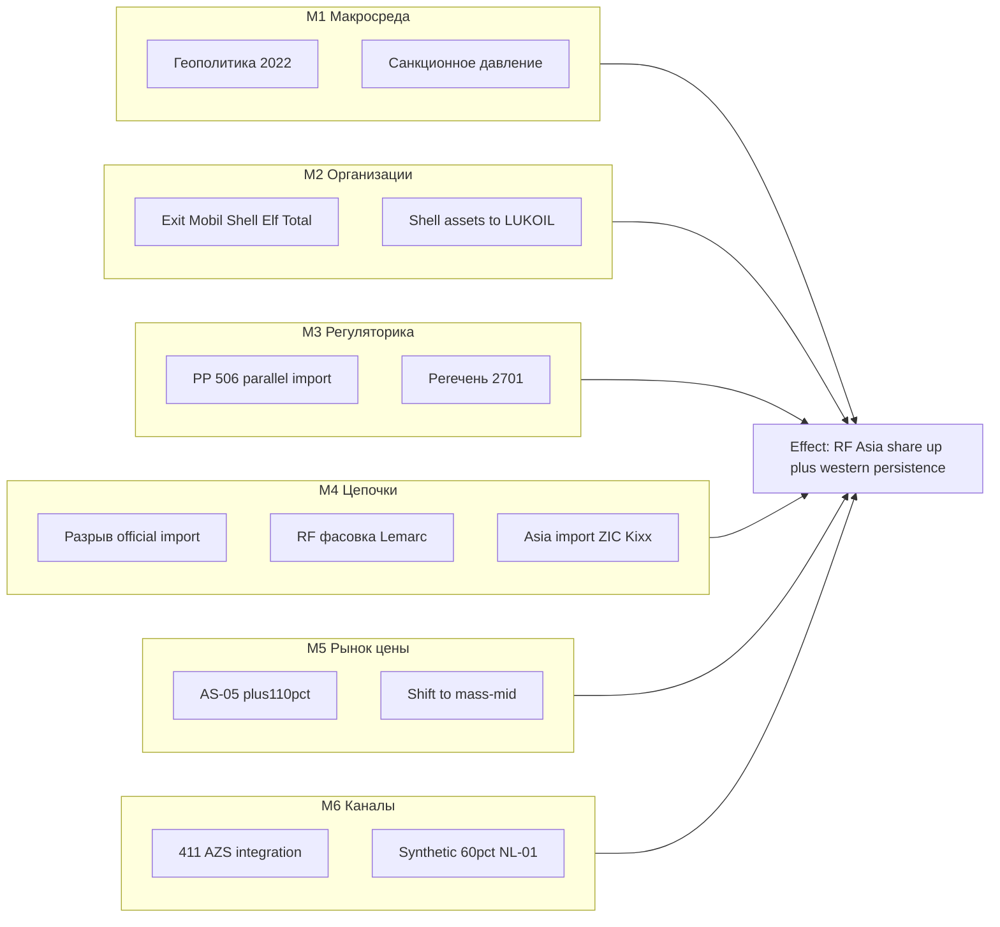
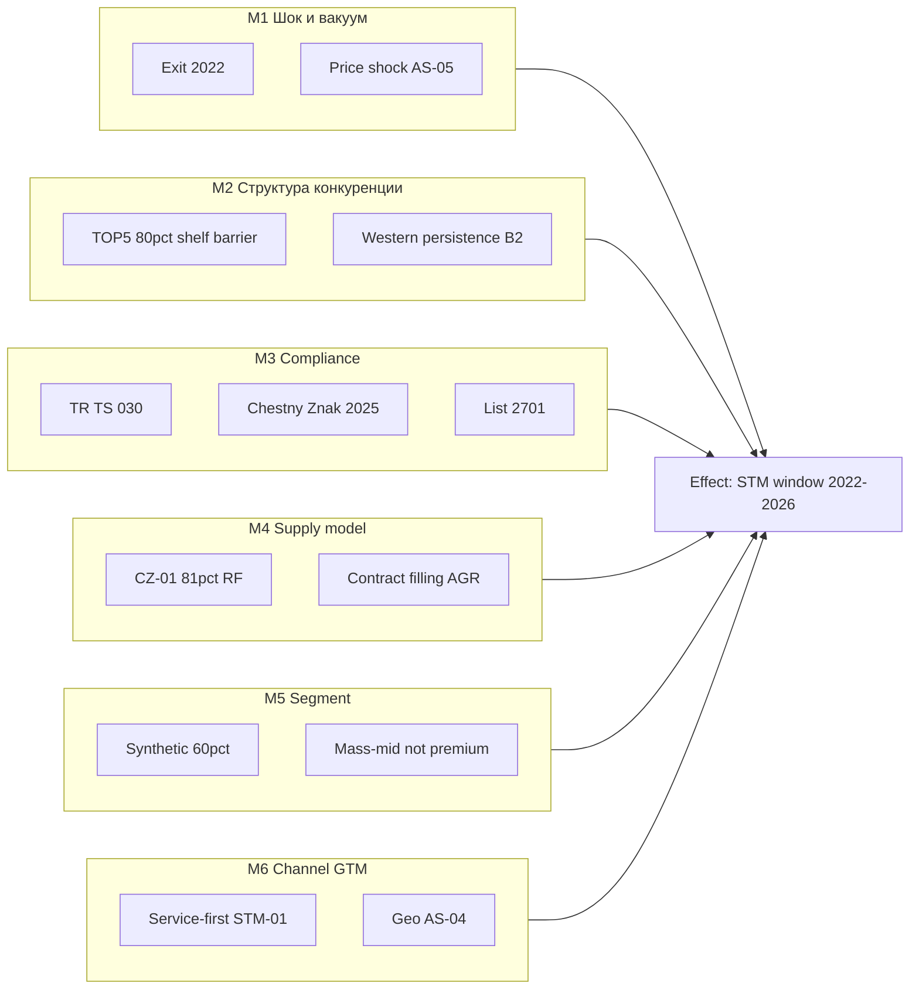

# Декомпозиция DR-A · Инструмент 6: Ishikawa · Задача 1

**Инструмент:** Ishikawa (диаграмма «рыба», 6M — причинно-следственная декомпозиция)  
**Основа:** ST T1 (`08_ST_*`), MECE D0–D3, GQM Q1.5 / G2, `A_канон_диплом.md` §3.5–3.9, §4  
**Дата:** 16.06.2026 · **Статус:** ✅ T1

**Назначение:** разложить **два эффекта** на **первичные причины** (6 категорий 6M), без новых цифр; подготовить §3.5 и §4 к F4 и связку со **Root Cause · T1**.

---

## 1. Метод и адаптация 6M под DR-A

Классические **6M** (Man, Machine, Method, Material, Measurement, Mother Nature) для **рынка**, не завода:

| 6M | Категория в DR-A | Примеры факторов |
|:--:|------------------|------------------|
| **M1** | **Макросреда** | Геополитический контекст 2022; санкционное давление на ops |
| **M2** | **Организации** | Корпоративные exit; M&A (Shell → LUKOIL) |
| **M3** | **Регуляторика** | № 506, перечень № 2701; ТР ТС 030/2012; ЧЗ 01.09.2025 |
| **M4** | **Цепочки поставок** | Сбой официального импорта; RF-фасовка; Lemarc/Ворсино |
| **M5** | **Рынок и цены** | AS-05 +110%/+124%; переключение mass vs premium |
| **M6** | **Каналы и конкуренция** | 411 АЗС Shell; synthetic ~60%; service-СТМ |

**Правило канона:** Ishikawa фиксирует **причины**, не **метрики лидерства**; цифры долей — только из S2/V1/NL-01/CZ-01 с Anti-metric.

---

## 2. Рыба №1 — эффект: структурный сдвиг долей (RF/Asia ↑)

**Головная кость (Effect / Problem):**  
«После 2022 г. **retail-структура** сместилась в пользу российских и азиатских марок (S2 2023; V1 p.p. 2022→11М2023), при **сохранении** остаточного присутствия западных канистр (brand persistence).»

**GQM:** Q1.5, Q1.3, Q1.4 · **MECE:** D0, D1, D2, D3 · **ST:** R1, B1, B2 · **§:** 3.3–3.6

### 2.1. Декомпозиция по 6M

| 6M | Причина (bone) | Факт / ID | ST / ER |
|:--:|----------------|-----------|---------|
| **M1** | Геополитический шок → давление на западные ops в РФ | EX-01, SH-03, TO-01, CA-01 | F1 (EXT) |
| **M2** | **Corporate exit** Mobil, Shell, Elf, Total (+ Castrol ops) | D0; SH-02 411 АЗС → LUKOIL | Operator exited → R6 |
| **M2** | Продажа активов Shell **не** = исчезновение Brand на полке | SH-02 vs S2 Shell 4,5% | Brand ≠ Operator |
| **M3** | Параллельный импорт (№ 506 → № 2701) — «правовой карман» | F0b, 123 бренда | B2, R7 |
| **M3** | ЧЗ с 01.09.2025 — единый контур (импорт + РФ) | MK-05, R18 | B3 (задержка D3) |
| **M4** | Разрыв **официальных** цепочек поставок premium-import | AS-05 дефицит premium | B1 |
| **M4** | Локализация мощностей (Lemarc/Top Lubricants, Ворсино) | D2.1; **не** в табл. долей | R17 |
| **M4** | Азиатский импорт (ZIC, Kixx) заполняет вакуум | V1 ZIC +2,4 p.p. | R1 |
| **M5** | Ценовой шок: LUKOIL **+110%**, Shell **+124%**, Mobil **+138%** | AS-05 | B1, F4 |
| **M5** | Переключение спроса на **mass-mid** RF/Asia | S2 тройка 37,1% | R1 |
| **M6** | Усиление дистрибуции LUKOIL (+ Shell АЗС) | SH-02 | R2 |
| **M6** | Рост **синтетики** ~60% → концентрация domestic ТОП‑5 | NL-01 | R3 |
| **M6** | Импорт 2024 (Shell в топ-импортёрах) ≠ retail share | AS-03; R8 | B2 |

### 2.2. Диаграмма (Mermaid)

### 2.3. Первичные vs вторичные причины (для Root Cause · T1)

| Приоритет | Причина | Почему первичная |
|:---------:|---------|------------------|
| **P1** | M2 Corporate exit | Запускает вакуум официальных каналов (D0) |
| **P1** | M5 Ценовой шок AS-05 | Ускоряет переключение спроса (B1) |
| **P2** | M4 Asia + RF fill | Механизм замещения объёма |
| **P2** | M6 LUKOIL + синтетика | Закрепляет лидерство post-shock |
| **P3** | M3 Parallel import | **Балансирует** эффект — persistence (B2), не драйвер RF gain |
| **P3** | M1 Макросреда | Контекст; не измеряется отдельной метрикой |

---

## 3. Рыба №2 — эффект: окно возможностей для СТМ (2022–2026)

**Головная кость (Effect):**  
«Появилось **структурное окно** для запуска **СТМ** в mass-mid synthetic с опорой на **service-first** и **compliance**, без претензии на federal shelf-leadership.»

**GQM:** G2, Q2.1–Q2.3 · **ST:** leverage 4, 6, 8, 9; archetypes · **§:** 3.9, 4

### 3.1. Декомпозиция по 6M

| 6M | Причина (bone) | Факт / ID | §4 |
|:--:|----------------|-----------|-----|
| **M1** | Вакуум после exit + ценовой шок → спрос на **альтернативы** | D0, AS-05 | §4.1, §4.3 |
| **M2** | Концентрация DIY: ТОП‑5 ~80% синтетики — **барьер полки** | NL-01 | §4.2 shelf-first слаб |
| **M3** | Единый compliance: 030/2012 + ЧЗ + № 2701 | MK-05, F0b | §4.5 traceability |
| **M3** | Параллельный импорт держит **оригинал** на полке — СТМ ≠ «замена Shell» | §3.9.2 | §4.3 positioning |
| **M4** | Локализация 81% отеч. (CZ-01) — RF-контур масштабируем | CZ-01 | §4.1 mass-mid |
| **M4** | Контрактная фасовка (паттерн AGR / SINTEC) | STM-01 | §4.2 |
| **M5** | Synthetic **~60%** — целевой сегмент СТМ | NL-01 | §4.1 |
| **M5** | Premium ₽/л — **не** ядро СТМ | S2 ₽/л | Anti: premium head-on |
| **M6** | **Service-first**: AGR >500 тыс. л / 6 мес., 300+ СТО | STM-01 | §4.2 |
| **M6** | Dealer-trust: MZD, Eurorepar | KM-01 | §4.2 |
| **M6** | География GTM: ЦФО+СЗФО+ЮФО ≈49% парка | AS-04 | §4.4 |

### 3.2. Диаграмма (Mermaid)

### 3.3. Импликации для GTM (из рыбы №2)

| Кость 6M | Действие СТМ | Anti-pattern |
|----------|--------------|--------------|
| M5 synthetic | SKU: mass-mid 5W-30 / 5W-40 | Premium-import clone |
| M6 service | Первый канал — СТО/франшиза | DIY полка vs LUKOIL |
| M3 compliance | Traceability-first с 2025 | «Серый» контур |
| M2 barrier | Ниша, не лобовой №1 shelf | % доли СТМ в таблице |
| M3 + M2 | Позиция: **надёжный RF SKU**, не «дешевле Mobil» | Shifting burden на клон |

---

## 4. Склейка Ishikawa ↔ ST ↔ ER ↔ GQM

| Ishikawa | ST петля | ER связь | GQM |
|----------|----------|----------|-----|
| M2 exit (рыба 1) | R1 | Operator exited → Brand | Q1.5 |
| M3 № 2701 | B2 | ParallelImportRegime | Q1.6 |
| M5 AS-05 | B1 | PriceShock | Q1.5 |
| M6 synthetic | R3 | ProductSegment | Q1.7 |
| M3 ЧЗ (рыба 2) | B3, leverage 9 | ComplianceContour | Q2.1 |
| M6 AGR | R4 | STMCase | Q2.2 |
| M5 mass-mid | — | ProductSegment | §4.1 |

**Логическая цепочка:**  
Рыба №1 (причины сдвига) → **системное состояние 2023** (S2) → Рыба №2 (почему это окно для СТМ) → §4 GTM.

---

## 5. Карта Ishikawa → § диплома

| § | Рыба | Что вставить в F4 |
|---|------|-------------------|
| **3.5** | №1 | M1–M6 как подпункты шока; табл. exit + AS-05 |
| **3.6** | №1 | M3, M4, M6 (persistence, import ≠ share) |
| **3.7** | №1 | M6 synthetic |
| **3.9** | №1 M3 + №2 M3 | compliance + parallel import |
| **3.9.4** | №2 M4, M6 | кейсы AGR/MZD |
| **§4** | №2 целиком | GTM по костям M5–M6 |
| **3.10** | — | не трактовать Ishikawa как прогноз долей |

**Абзац для §3.5 (черновик, 2 предложения):**  
«Структурный сдвиг 2022–2023 гг. объясняется совокупностью факторов: **корпоративный exit** западных операторов (M2), **ценовой шок** retail (M5, AS-05) и **замещение** через российскую и азиатскую фасовку (M4, M6), при этом **параллельный импорт** (M3) поддерживает brand persistence западных марок и не отменяет рост RF/Asia в mass-сегменте.»

**Абзац для §4 (1 предложение):**  
«Окно для СТМ формируют **barrier полки** у лидеров синтетики (M2), **целевой сегмент** mass-mid ~60% (M5) и **единый compliance-контур** 2025 г. (M3), реализуемый через **service-first** канал (M6), а не через конкуренцию с premium-import на DIY-полке.»

---

## 6. Анти-паттерны Ishikawa

| Ошибка | Почему неверно |
|--------|----------------|
| Одна «главная причина» = только санкции | Игнор M5 цен, M6 каналов, M4 supply |
| Parallel import = причина роста LUKOIL | M3 → B2 **балансирует**, не драйвер R1 |
| Lemarc в рыбе как причина доли Total | R17: не в табл. долей |
| CZ-01 81% на кости «доля LUKOIL» | R19 |
| Ishikawa → прогноз % СТМ 2026 | R10; только качеств. кейсы |
| 6M без разделения рыб 1 и 2 | Смешение **диагностики рынка** и **GTM СТМ** |

---

## 7. Выводы Ishikawa · T1

1. **Две рыбы** — MECE: (1) почему сдвинулись доли; (2) почему открыто окно СТМ.  
2. **Первичные причины сдвига:** M2 exit + M5 цены; **M3 parallel import** — модератор persistence (P3).  
3. **Окно СТМ:** M5 segment + M6 service + M3 compliance; **не** shelf-leadership (M2 barrier).  
4. Полная стыковка со **ST** (R/B), **ER** (Operator≠Brand), **GQM** (Q1.5, G2).  
5. **T2 (опц.):** одна объединённая рыба для слайда защиты; **Root Cause · T1** — углубление P1/P2.

---

*Следующий инструмент (после одобрения): **Root Cause · T1** — ✅ `10_RootCause_T1_корневые_причины.md`.*
