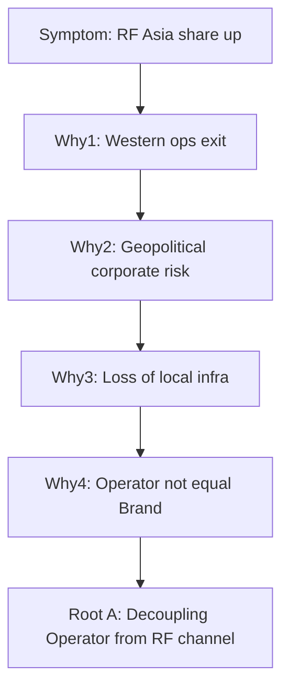
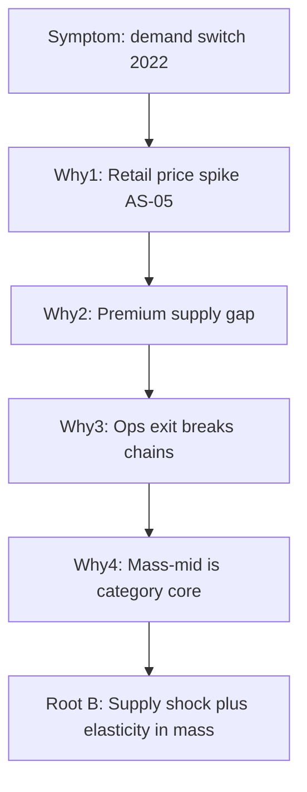
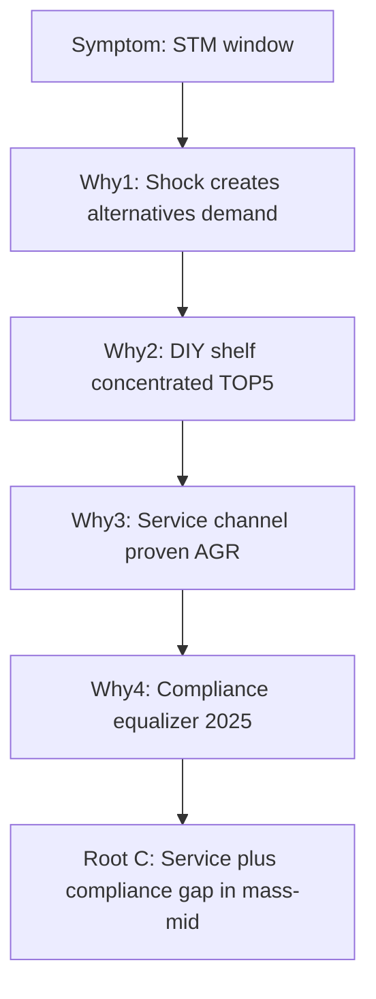

# Декомпозиция DR-A · Инструмент 7: Root Cause · Задача 1

**Инструмент:** Root Cause Analysis (5 Whys, root vs contributing)  
**Основа:** Ishikawa T1 §2.3 P1–P2 (`09_Ishikawa_*`), ST T1, MECE D0, GQM Q1.5 / G2  
**Дата:** 16.06.2026 · **Статус:** ✅ T1

**Назначение:** углубить **P1/P2** из Ishikawa до **корневых причин** (не симптомов); зафиксировать, что **не является** root cause (parallel import, «только санкции»). Подготовка **§3.5**, **§4** и переход к **Pareto · T1**.

---

## 1. Метод

| Термин | Определение в DR-A |
|--------|-------------------|
| **Симптом (Effect)** | Наблюдаемый факт: сдвиг S2/V1; окно СТМ |
| **Proximate cause** | Ближайшая причина (exit 2022; +110% цены) |
| **Contributing factor** | Усиливает/замедляет, но не запускает (№ 2701 → persistence) |
| **Root cause** | Структурное условие, без которого эффект **не воспроизводится** в той же форме |

**Правило канона:** 5 Whys **не добавляет** новых %; каждый шаг — verifiable ID или MECE-тезис.

**Три цепочки (MECE):**

| ID | Стартовый симптом | Ishikawa | GQM |
|----|-------------------|----------|-----|
| **RC-A** | RF/Asia ↑ retail share | P1 M2 exit | Q1.5, Q1.3 |
| **RC-B** | Ускорение переключения спроса 2022 | P1 M5 AS-05 | Q1.5 |
| **RC-C** | Окно для СТМ 2022–2026 | Рыба №2 | G2, §4 |

---

## 2. RC-A — 5 Whys: корпоративный exit → сдвиг долей

**Симптом:** после 2022 г. **российские и азиатские** марки усилились (S2 2023; V1 p.p.).

| # | Why? | Ответ (факт / логика) | ID / MECE |
|---|------|----------------------|-----------|
| **1** | Почему сместилась структура? | Западные **операторы** прекратили ops / продали активы в РФ | D0; EX-01, SH-03, TO-01, CA-01 |
| **2** | Почему ops ушли? | Геополитический кризис 2022 → **недопустимость** риска для matriz | M1; tier 1 пресс-релизы |
| **3** | Почему exit, а не «пауза»? | Потеря **локальной** инфраструктуры: заводы, дистрибуция, АЗС-сеть Shell | SH-02; D2 |
| **4** | Почему освободившийся объём не остался у тех же Brand? | **Operator ≠ Brand**: марка на канистре ≠ кто владел каналом | ER §5; R6 |
| **5** | **Root cause A** | **Структурное разделение западного Operator и RF-канала дистрибуции** — официальный контур исчез, замещение пошло через RF/Asia ops + параллельные каналы | ST R1; D0 |



**Вывод для §3.5:** exit — **не** «исчезновение бренда», а **разрыв operator–channel**; root = decoupling, не «санкции сами по себе».

---

## 3. RC-B — 5 Whys: ценовой шок → переключение mass

**Симптом:** лето **2022** — скачок цен; ускоренный shift на RF/Asia mass (AS-05; V1 p.p.).

| # | Why? | Ответ | ID |
|---|------|-------|-----|
| **1** | Почему покупатель сменил SKU? | **+110%** LUKOIL, **+124%** Shell, **+138%** Mobil (4 л, 6 городов) | AS-05 |
| **2** | Почему цены выросли так резко? | **Разрыв supply** premium-import + panic buying / дефицит на полке | AS-05; B1 |
| **3** | Почему supply premium-import сжался? | Exit ops + логистика / платежи / страховка цепочек 2022 | D0 + M4 |
| **4** | Почему mass RF/Asia выиграли, а не только «дешёвый сегмент»? | **Mass-mid synthetic** — ядро категории (~60% NL-01); RF уже в полке | NL-01; R3 |
| **5** | **Root cause B** | **Совместный supply shock и price elasticity в mass-сегменте** при одновременном operator-vacuum — переключение **структурное**, не сезонное | ST B1+R1 |



**Связка RC-A + RC-B:** два **независимых root**, **усиливающих** друг друга (ST R1 ∩ B1) — не сводить к одной «главной причине».

---

## 4. RC-P2 — механизмы замещения (Ishikawa P2)

Не отдельные 5 Whys, а **механизм** от root A/B к S2 2023:

| P2 фактор | Механизм | Root, которому подчинён | Метрика |
|-----------|----------|-------------------------|---------|
| **M4 Asia + RF fill** | ZIC/Kixx + RF-фасовка заняли **volume**, не brand-наследие Shell | RC-A | V1 ZIC +2,4 p.p. |
| **M6 LUKOIL + синтетика** | 411 АЗС Shell + лидерство в synthetic NL-01 | RC-A + R3 | SH-02; NL-01 |
| **M4 Lemarc/Ворсино** | Локализация **мощности**, не federal share Total | RC-A | D2.1; R17 |

**Proximate, не root:** Lemarc, AS-03 импорт 2024 — **следствия** decoupling, не первопричина сдвига.

---

## 5. RC-NOT — что **не** root cause (contributing / moderating)

| Кандидат | Статус | Обоснование |
|----------|--------|-------------|
| **Parallel import № 2701** | **Contributing (B2)** | Объясняет Shell 4,5% + AS-03; **не** драйвер LUKOIL 18,1% | Ishikawa P3; ST B2 |
| **«Только санкции»** | **Неполный proxy** | Без RC-B (цены) и M6 (каналы) картина неполна | Ishikawa anti-pattern |
| **CZ-01 81% отеч.** | **Post-hoc индикатор 2025** | Не причина сдвига 2022–23; ≠ brand share | R19 |
| **Lemarc = Total share** | **Ошибка** | R17 |
| **Channel DIY shift** | **н/д** | R2; не root без данных |

**5 Whys для persistence (moderator, не RF gain):**

| # | Why Shell 4,5% при exit? |
|---|--------------------------|
| 1 | Канистра Shell на полке через **неофициальный** импорт |
| 2 | № 506/2701 легализует parallel contour |
| 3 | Brand ≠ Operator — марка **живёт** без ops |
| 4 | ImportFlow ≠ ShareSnapshot retail | R8 |
| **5** | **Contributing:** правовой карман persistence; **не root** RF gain |

---

## 6. RC-C — 5 Whys: окно для СТМ

**Симптом:** возможен запуск **СТМ** mass-mid synthetic **без** претензии на №1 DIY (§4).

| # | Why? | Ответ | §4 |
|---|------|-------|-----|
| **1** | Почему «окно» открыто? | Exit + price shock создали **спрос на альтернативы** + RF-контур масштабируем | RC-A, RC-B |
| **2** | Почему не shelf-first vs LUKOIL? | ТОП‑5 synthetic ~**80%** — barrier полки | §4.2; NL-01 |
| **3** | Почему service-first работает? | Кейсы AGR **>500 тыс. л**, 300+ СТО — масштаб вне DIY-лидерства | STM-01 |
| **4** | Почему compliance — дифференциатор? | ЧЗ 01.09.2025: **единый** контур импорт+РФ; traceability = барьер «серого» | MK-05; R18 |
| **5** | **Root cause C** | **Структурный зазор канала service + compliance** при концентрации DIY и decoupling западных ops — СТМ выигрывает **traceable mass-mid в СТО**, не клон premium на полке | ST leverage 6, 8, 9 |



---

## 7. Сводная таблица root vs contributing

| Root / Role | Формулировка | Петля ST | § |
|-------------|--------------|----------|---|
| **RC-A** | Decoupling western **Operator** from RF distribution | R1 | 3.5, 3.6 |
| **RC-B** | Supply shock × price elasticity in **mass-mid** | B1 | 3.5 |
| **RC-C** | **Service + compliance** gap при DIY-концентрации | R4, B3 | 4 |
| **Contrib.** | Parallel import → western **persistence** | B2 | 3.6, 3.9 |
| **Contrib.** | LUKOIL + Shell АЗС, synthetic growth | R2, R3 | 3.4.1, 3.7 |
| **Not root** | CZ-01 81%; Lemarc; «только санкции» | — | 3.10 |

---

## 8. Склейка Root Cause ↔ Ishikawa ↔ ST ↔ GQM

```
Ishikawa P1 (M2, M5)
    → 5 Whys RC-A, RC-B
        → Root A + Root B (dual root)
            → S2 2023 snapshot
                → Ishikawa Fishbone 2
                    → RC-C (STM window)
                        → §4 GTM
```

| GQM Q | Root answer |
|-------|-------------|
| Q1.5 «Что изменил шок 2022?» | RC-A + RC-B (exit + цены); persistence = contrib |
| Q1.6 «Shell ушёл = 0%?» | RC-NOT: parallel import = contrib B2 |
| Q2.1–Q2.3 «Окно СТМ?» | RC-C |

---

## 9. Карта Root Cause → § диплома

| § | Вставка F4 |
|---|------------|
| **3.5** | RC-A + RC-B; dual root; табл. exit + AS-05 |
| **3.6** | RC-NOT (persistence); Brand ≠ Operator |
| **3.7** | P2 M6 synthetic как **закрепление**, не root |
| **3.9** | RC-C compliance leg; parallel import = contrib |
| **§4** | RC-C → GTM service-first + traceability |
| **3.10** | Не называть CZ-01 / NL-01 «root cause» сдвига 2022 |

**Абзац §3.5 (черновик):**  
«Корневыми причинами структурного сдвига 2022–2023 гг. выступают **(а)** разрыв между западным оператором и российским каналом дистрибуции (RC-A) и **(б)** сочетание supply shock с переключением спроса в mass-mid при скачке цен (RC-B, AS-05). Параллельный импорт объясняет **остаточное** присутствие западных марок (contributing factor), но не рост LUKOIL и тройки RF-производителей.»

**Абзац §4 (черновик):**  
«Окно для СТМ (RC-C) обусловлено концентрацией DIY-синтетики у лидеров и доказанной масштабируемостью service-first моделей при едином compliance-контуре с 2025 г.; стратегия — traceable mass-mid в СТО, а не замещение premium-import на полке.»

---

## 10. Анти-паттерны Root Cause

| Ошибка | Исправление |
|--------|-------------|
| Одна root = «санкции» | RC-A + RC-B |
| Parallel import = почему LUKOIL №1 | RC-NOT; S2 vs AS-03 |
| 5 Whys → новые % 2024–26 | P3 н/д |
| RC-C → «СТМ займёт 10% рынка» | R10 |
| Lemarc в цепочке как root Total | R17 |
| Игнор dual root | RC-A ∩ RC-B обязательны в §3.5 |

---

## 11. Выводы Root Cause · T1

1. **Dual root** сдвига долей: **RC-A** (operator decoupling) + **RC-B** (supply shock × elasticity).  
2. **Parallel import** — **contributing** persistence (B2), не root RF gain.  
3. **RC-C** — root окна СТМ: service + compliance при DIY-barrier.  
4. P2 (Asia fill, LUKOIL+synthetic) — **механизмы** от RC-A/B к S2 2023.  
5. **T2 (опц.):** one-page causal tree для защиты; **Pareto · T1** — ранжирование костей Ishikawa по «impact».

---

*Следующий инструмент (после одобрения): **Pareto · T1** — ✅ `11_Pareto_T1_правило_8020.md`.*
