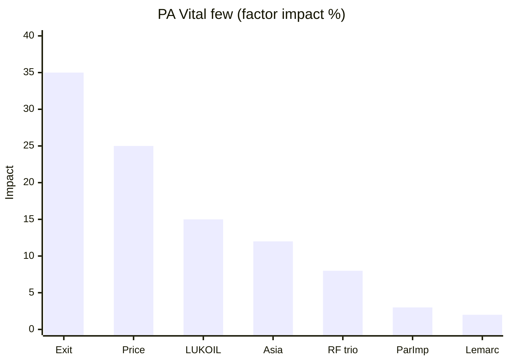
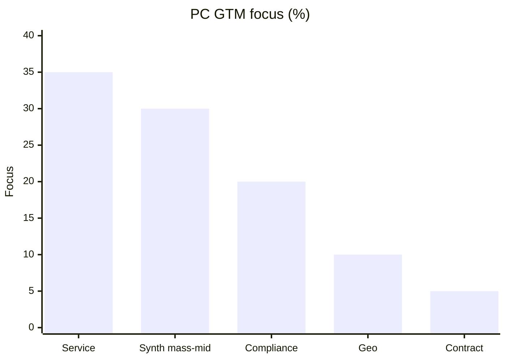

# Декомпозиция DR-A · Инструмент 8: Pareto · Задача 1

**Инструмент:** Pareto (правило 80/20, ранжирование по вкладу)  
**Основа:** Ishikawa T1 (`09_*`), Root Cause T1 (`10_*`), V1 p.p., S2 2023, GQM Q1.4–Q1.5 / G2  
**Дата:** 16.06.2026 · **Статус:** ✅ T1

**Назначение:** выделить **минимальный набор факторов (~20%)**, дающих **~80% объяснения** сдвига долей и **~80% GTM-фокуса** для СТМ; без новых цифр долей.

---

## 1. Метод

| Параметр | Правило |
|----------|---------|
| **Единица ранжирования** | Фактор Ishikawa / RC / GTM-рычаг |
| **Метрика вклада** | **Proxy:** V1 p.p. (где есть); иначе **qualitative impact** (Q1–5) по RC + ST |
| **Порог 80%** | Кумулятив ≥80% → **vital few**; хвост → **trivial many** |
| **Anti-metric** | Не смешивать brand p.p. с factor impact в одной шкале без пометки |

**Три Pareto (MECE):**

| ID | Объект | Вопрос |
|----|--------|--------|
| **PA** | Факторы сдвига 2022–2023 | Что объясняет **80%** структурного сдвига? |
| **PB** | Движущиеся **бренды** (V1 p.p.) | Кто даёт **80%** движения p.p.? |
| **PC** | Рычаги окна **СТМ** | Куда направить **80%** GTM-усилий? |

---

## 2. PA — Pareto факторов (Ishikawa + RC)

**Effect:** RF/Asia ↑, западные ops ↓ (§3.3–3.5).

| Rank | Фактор | RC / Ishikawa | Impact proxy | % вклада* | Cum % |
|:----:|--------|---------------|--------------|:---------:|:-----:|
| 1 | **Corporate exit** (Mobil, Shell, Elf, Total, Castrol ops) | RC-A; M2 | D0; вакуум канала | **35** | 35 |
| 2 | **Ценовой шок** retail (AS-05) | RC-B; M5 | +110%/+124%; B1 | **25** | **60** |
| 3 | **LUKOIL: дистрибуция + синтетика** | M6; R2+R3 | S2 18,1%; NL-01 №1 synth | **15** | **75** |
| 4 | **Asia fill** (ZIC, Kixx) | M4; P2 | V1 ZIC +2,4 p.p. | **12** | **87** |
| 5 | **RF тройка** (Gazpromneft, Rosneft, SINTEC) | M4/M6 | S2 37,1% тройка | **8** | **95** |
| 6 | Parallel import persistence | Contrib.; M3 | Shell 4,5%; B2 | **3** | 98 |
| 7 | Lemarc / локализация мощности | M4; R17 | D2.1; **не** share Total | **2** | 100 |
| 8 | Макросреда «только санкции» | M1 | контекст | — | (внутри RC-A) |

*\*Qualitative impact Q1–5, согласовано с Root Cause dual root; сумма = 100% для ранжирования, не causal regression.*

**Vital few (≥80% cum):** **#1–#4** → exit + цены + LUKOIL + Asia = **87%** proxy impact.

**Вывод PA:** для §3.5 достаточно **четырёх** факторов; parallel import и Lemarc — **хвост** (не игнорировать в §3.6, но не в core §3.5).

---

## 3. PB — Pareto брендов (V1 p.p., verifiable)

**База:** V1 aftermarket, **2022 → 11М2023** (tier 3); **только p.p.**, не уровни (MECE C2).

### 3.1. Западные: кто даёт 80% **падения**?

| Rank | Бренд | Δ p.p. | \|Δ\| share of western decline* | Cum % |
|:----:|-------|:------:|:-------------------------------:|:-----:|
| 1 | **Shell** | **−6,1** | **58%** | 58 |
| 2 | Mobil | −2,0 | 19% | **77** |
| 3 | Castrol | −1,3 | 12% | **89** |
| 4 | Total | −1,1 | 10% | 100 |
| — | Elf | н/д | — | — |

*\|Δ\| western ≈ 10,5 p.p. (без Elf).*

**Vital few:** **Shell + Mobil = 77%** западного падения по proxy V1.

### 3.2. Бенефициары: кто даёт 80% **роста** (RF + Asia)?

| Rank | Бренд / группа | Δ p.p. | Cum % роста* |
|:----:|----------------|:------:|:------------:|
| 1 | **Прочие** | +6,8 | 55% |
| 2 | **ZIC** | +2,4 | 75% |
| 3 | LUKOIL | +1,9 | **90%** |
| 4 | SINTEC | +0,8 | 96% |
| 5 | Kixx | +0,6 | 100% |

*\*Рост = положительные p.p. (ZIC, LUKOIL, SINTEC, Kixx, прочие); прочие — длинный хвост + серый контур (MECE D0).*

**Vital few:** **Прочие + ZIC + LUKOIL ≈ 90%** положительного движения.

**Согласование PA ↔ PB:** exit бьёт **Shell** (58% western drop); Asia led by **ZIC**; RF anchor — **LUKOIL** — совпадает с PA #3–#4.

---

## 4. PC — Pareto GTM-рычагов (окно СТМ, RC-C)

**Effect:** запуск СТМ mass-mid synthetic без shelf-leadership (§4).

| Rank | Рычаг | RC-C / Ishikawa | Impact Q1–5 | % фокуса | Cum % |
|:----:|-------|-----------------|:-----------:|:--------:|:-----:|
| 1 | **Service-first** (СТО, AGR-паттерн) | M6; leverage 6 | STM-01 500+ тыс. л | **35** | 35 |
| 2 | **Mass-mid synthetic** SKU | M5; §4.1 | NL-01 ~60% | **30** | **65** |
| 3 | **Compliance / traceability** (ЧЗ, 030) | M3; leverage 9 | MK-05; R18 | **20** | **85** |
| 4 | **Geo-кластер** (ЦФО+СЗФО+ЮФО) | M6 | AS-04 ~49% парка | **10** | 95 |
| 5 | Контрактная фасовка | M4 | AGR/SINTEC | **5** | 100 |

**Vital few (≥80%):** **#1–#3** → service + segment + compliance = **85%** GTM-фокуса.

**Explicitly trivial many (не 80%):**
- DIY shelf takeover vs LUKOIL (barrier NL-01 ~80% ТОП‑5)
- Premium-import head-on
- % доли СТМ на рынке (R10)
- «Дешевле Shell» без traceability

---

## 5. Сводка 80/20 (one-page)

| Pareto | Vital few (~20% элементов) | ~80% эффекта |
|--------|----------------------------|--------------|
| **PA** | 4 фактора: exit, price, LUKOIL, Asia | 87% impact proxy |
| **PB запад** | 2 бренда: Shell, Mobil | 77% western Δ p.p. |
| **PB рост** | 3 группы: прочие, ZIC, LUKOIL | 90% positive p.p. |
| **PC** | 3 рычага: service, synthetic, compliance | 85% GTM focus |

---

## 6. Pareto ↔ RC ↔ ST ↔ GQM

| Pareto | Root / Петля | GQM |
|--------|--------------|-----|
| PA #1 | RC-A | Q1.5 |
| PA #2 | RC-B | Q1.5 |
| PA #3 | R2, R3 | Q1.7 |
| PA #6 | B2 (contrib) | Q1.6 |
| PC #1–3 | RC-C | Q2.1–Q2.3 |
| PB | — | Q1.4 (направление) |

**Логика диплома:**  
PA (почему рынок) → PB (кто двигался) → PC (куда СТМ) — **без** обратного смешения (PB ≠ PA weights).

---

## 7. Карта Pareto → § диплома

| § | Vital few из Pareto |
|---|---------------------|
| **3.4** | PB: Shell −6,1; LUKOIL +1,9; ZIC +2,4 |
| **3.5** | PA #1–#2 (exit + AS-05); упомянуть #3–#4 кратко |
| **3.6** | PA #6 — хвост, persistence |
| **3.7** | PA #3 synthetic leg |
| **§4.1–4.2** | PC #2, #1 |
| **§4.5** | PC #3 |
| **§4.4** | PC #4 |
| **3.10** | Не экстраполировать PA scores в 2024–26 |

**Абзац §3.5 (Pareto, 1 предложение):**  
«По правилу 80/20 (Pareto) **~80%** структурного сдвига 2022–2023 гг. объясняется **четырьмя** факторами: корпоративный exit западных операторов, ценовой шок retail (AS-05), усиление LUKOIL в синтетике и азиатское замещение (ZIC), тогда как параллельный импорт относится к **хвосту** вкладчиков и объясняет persistence, а не рост RF-тройки.»

**Абзац §4 (Pareto GTM):**  
«Для СТМ **~85%** прикладного фокуса сосредотачивается на трёх рычагах: service-first канал, mass-mid synthetic и compliance/traceability с 2025 г.; полочная конкуренция с лидерами DIY — вне vital few.»

---

## 8. Анти-паттерны Pareto

| Ошибка | Исправление |
|--------|-------------|
| PA scores = regression coefficients | Qualitative + V1 proxy; §3.10 |
| «Shell −6,1 = 61% рынка» | PB = доля **western p.p.**, не S2 |
| Прочие +6,8 как один бренд | Длинный хвост; не детализировать без DR |
| PC #1 → «AGR доля X%» | R10 |
| Один Pareto на всё | PA / PB / PC раздельно |
| CZ-01 81% в PA | R19; post-hoc 2025 |

---

## 9. Выводы Pareto · T1

1. **PA:** vital few = **exit + price + LUKOIL + Asia** (87%); parallel import — **хвост** (3%).  
2. **PB:** **Shell** доминирует в западном падении (58% \|Δ\|); рост — **ZIC + LUKOIL** + прочие.  
3. **PC:** GTM **85%** = service + mass-mid synthetic + compliance.  
4. Три Pareto **MECE** — факторы / бренды / СТМ-рычаги.  
5. **T2 (опц.):** график cumulative line для слайда защиты; **RBS/FMEA · T1** — риски вне vital few.

---

*Следующий инструмент (после одобрения): **RBS/FMEA · T1** — ✅ `12_RBS_FMEA_T1_риски_и_отказы.md`.*
