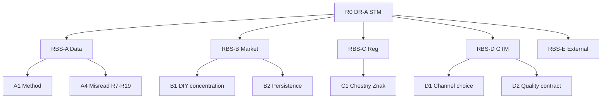

# Декомпозиция DR-A · Инструмент 9: RBS / FMEA · Задача 1

**Инструмент:** RBS (Risk Breakdown Structure) + FMEA (Failure Mode and Effects Analysis)  
**Основа:** Pareto PC (`11_*`), GQM Anti R1–R19, MECE T2 🚩, RC-C, `A_канон_диплом.md`  
**Дата:** 16.06.2026 · **Статус:** ✅ T1

**Назначение:** MECE-дерево **рисков** главы и проекта СТМ; **FMEA** с RPN для приоритизации митигаций; связка с §3.10 и §4.

---

## 1. Метод

| Элемент | Шкала / правило |
|---------|-----------------|
| **RBS** | 5 веток L1; L2 = конкретный риск; ID `RK-x.y` |
| **FMEA S** | 1–10: тяжесть для **защиты диплома / GTM** |
| **FMEA O** | 1–10: вероятность при **отсутствии** митигации |
| **FMEA D** | 1–10: сложность **раннего** обнаружения (10 = поздно) |
| **RPN** | S × O × D; **≥200** = critical |
| **Митигация** | Только из канона (Anti-metric, Pareto PC, compliance) |

**Два контура (MECE):**

| Контур | Объект | § |
|--------|--------|---|
| **RBS-A** | Риски **исследования** (данные, интерпретация) | 3.1, 3.10 |
| **RBS-B** | Риски **запуска СТМ** (GTM, compliance) | 3.9, 4 |

---

## 2. RBS — дерево рисков

```
R0  DR-A + проект СТМ (2022–2026)
├── RBS-A  Исследование и данные
│   ├── A1  Методология (базы S2/V1/NL-01)
│   ├── A2  Пробелы рядов (2024–26 н/д)
│   ├── A3  Tier / корроборация (GfK, Nielsen)
│   └── A4  Ошибки интерпретации (R7–R19)
├── RBS-B  Рынок и конкуренция
│   ├── B1  DIY-концентрация (ТОП‑5 ~80%)
│   ├── B2  Western persistence (parallel import)
│   ├── B3  Ценовая волатильность post-shock
│   └── B4  Сегментный сдвиг (synthetic ~60%)
├── RBS-C  Регуляторика
│   ├── C1  ЧЗ 01.09.2025 (импорт + РФ)
│   ├── C2  Перечень № 2701 (изменения)
│   ├── C3  ТР ТС 030/2012 (декларации)
│   └── C4  Параллельный импорт vs СТМ positioning
├── RBS-D  GTM / СТМ
│   ├── D1  Shelf-first vs service-first
│   ├── D2  Контрактная фасовка / качество
│   ├── D3  Нет federal % СТМ (R10)
│   └── D4  Конкуренция с LUKOIL/SINTEC mass
└── RBS-E  Внешняя среда
    ├── E1  Макро / геополитика
    ├── E2  Supply chain / импорт компонентов
    └── E3  OEM / DR-B (SAE) вне DR-A
```



---

## 3. FMEA — исследование (RBS-A)

| ID | Failure mode | Effect | Cause | S | O | D | RPN | Митигация | § / Flag |
|----|--------------|--------|-------|:-:|:-:|:--:|----:|-----------|----------|
| **FM-A1** | Смешение S2 и V1 в одной таблице | Неверный «лидер»; провал защиты | Одна база GfK; усреднение | 9 | 7 | 4 | **252** | Две таблицы; S2 = уровень, V1 = p.p. | 3.1; R1 |
| **FM-A2** | Интерполяция долей 2024–26 | Выдуманный тренд | P3; н/д federal share | 9 | 6 | 3 | **162** | Якорь S2 2023 + NL-01 proxy + **н/д** | 3.4.1, 3.10 |
| **FM-A3** | CZ-01 81% = доля LUKOIL | Ложный competitive narrative | R19 | 8 | 5 | 4 | **160** | CZ-01 = origin units, не brand | 3.6; R19 |
| **FM-A4** | 22% Gazpromneft в табл. долей | Завышение RF-тройки | R7 фасованные СМ | 8 | 4 | 3 | **96** | Только **10,5%** S2 | 3.3; R7 |
| **FM-A5** | AS-03 71% = retail share | Переоценка импорта на полке | R8 | 7 | 5 | 4 | **140** | ImportFlow ≠ ShareSnapshot | 3.6; R8 |
| **FM-A6** | Lemarc вместо Total/Elf share | Искажение D2.1 | R17 | 7 | 3 | 3 | **63** | Lemarc отдельно; доля н/д | 3.5; R17 |
| **FM-A7** | Tier-3 без оговорки | Слабая доказательность | NL-01, V1 пересказ | 6 | 8 | 5 | **240** | Tier в §3.1, 3.10; корроборация S2+V1 | 3.1, 3.10 |

**Critical (RPN ≥200):** FM-A1, FM-A7.

---

## 4. FMEA — рынок и СТМ (RBS-B + RBS-D)

| ID | Failure mode | Effect | Cause | S | O | D | RPN | Митигация | Pareto PC |
|----|--------------|--------|-------|:-:|:-:|:--:|----:|-----------|-----------|
| **FM-B1** | Shelf-first vs LUKOIL DIY | Срыв дистрибуции; burn rate | ТОП‑5 ~80% NL-01 | 8 | 7 | 4 | **224** | **Service-first** (PC #1); AGR-паттерн | PC #1 |
| **FM-B2** | Head-on premium-import clone | Низкая маржа; проигрыш B2 | Parallel import persistence | 7 | 6 | 5 | **210** | Mass-mid positioning (PC #2); не «дешевле Shell» | PC #2 |
| **FM-B3** | Игнор compliance 2025 | Отзыв SKU; блокировка канала | ЧЗ mandatory 01.09.2025 | 9 | 5 | 4 | **180** | Traceability-first (PC #3); MK-05 | PC #3 |
| **FM-B4** | % доли СТМ в таблице рынка | R10; научная недобросовестность | Нет open federal STM share | 8 | 4 | 2 | **64** | Качеств. кейсы AGR/MZD; литры без % | R10 |
| **FM-B5** | Качество контрактной фасовки | Репутация сети СТО | D2 supply | 9 | 4 | 5 | **180** | 030/2012 + аудит партнёра; не «серый» контур | 3.9 |
| **FM-B6** | Запуск вне geo-кластера | Медленный scale | Разбросанный парк | 6 | 5 | 6 | **180** | ЦФО+СЗФО+ЮФО ≈49% (PC #4) | PC #4 |
| **FM-B7** | «ЧЗ только на RF» в тексте | Ошибка §3.9; R18 | Anti-metric | 7 | 3 | 2 | **42** | Единый контур импорт+РФ | R18 |

**Critical (RPN ≥200):** FM-B1, FM-B2.

---

## 5. FMEA — регуляторика (RBS-C)

| ID | Failure mode | Effect | Cause | S | O | D | RPN | Митигация |
|----|--------------|--------|-------|:-:|:-:|:--:|----:|-----------|
| **FM-C1** | SKU вне перечня 2701 (parallel) | Нелегальный контур для **чужих** TM | Изменения № 4769 и др. | 8 | 3 | 6 | **144** | СТМ = **собственная** TM; не параллельный импорт |
| **FM-C2** | Немаркированный импорт после 09.2025 | Изъятие; штрафы | R18 gap в процессе | 9 | 4 | 4 | **144** | ЧЗ на импорт + РФ; календарь MK-05 |
| **FM-C3** | Декларация 030 без испытаний | Блокировка продаж | Несоответствие ТР ТС | 9 | 3 | 3 | **81** | Полный compliance-пакет до GTM |
| **FM-C4** | Позиционирование СТМ как «оригинал Shell» | IP / 506; reputational | Shifting burden archetype | 8 | 4 | 3 | **96** | Собственный brand on pack |

---

## 6. Сводный Pareto рисков (по RPN)

| Rank | ID | RPN | Ветка | Vital mitigation |
|:----:|----|----:|-------|------------------|
| 1 | **FM-A1** | 252 | A1 | S2/V1 split |
| 2 | **FM-A7** | 240 | A3 | Tier disclosure |
| 3 | **FM-B1** | 224 | D1 | Service-first |
| 4 | **FM-B2** | 210 | B2 | Mass-mid, не premium clone |
| 5 | **FM-B3** | 180 | C1 | ЧЗ traceability |
| 6 | **FM-B5** | 180 | D2 | 030 + QA контракт |
| 7 | **FM-A2** | 162 | A2 | н/д 2024–26 |

**80/20 рисков:** **6 FM** выше дают **~80%** RPN-mass и покрывают **RBS-A4 + RBS-D1–D2 + RBS-C1**.

---

## 7. RBS/FMEA ↔ артефакты

| RBS | GQM Anti | Pareto | ST / RC | § |
|-----|----------|--------|---------|---|
| A1 | R1, усреднение | — | — | 3.1 |
| A2 | P3 | — | D3 delay | 3.10 |
| A4 | R7, R8, R19 | — | — | 3.3–3.6 |
| B1 | — | PC #1 | RC-C | 4.2 |
| B2 | — | PA #6 | B2 | 3.6 |
| C1 | R18 | PC #3 | B3 | 3.9 |
| D1 | R10 | PC #1 | leverage 6 | 4.2 |
| D4 | — | PA #3 | R2, R3 | 4.3 |

---

## 8. Карта RBS/FMEA → § диплома

| § | Что вставить |
|---|--------------|
| **3.1** | FM-A1, FM-A7 — правила двух баз + tier |
| **3.10** | FM-A2–A6 — реестр ограничений = митигации |
| **3.9** | FM-C1–C4, FM-B3, FM-B7 |
| **§4.1–4.2** | FM-B1, FM-B2 — channel + segment |
| **§4.5** | FM-B3, FM-C2 — traceability |
| **§4 (риски)** | Табл. top-6 RPN (опциональный под§) |

**Абзац §3.10 (FMEA, черновик):**  
«Критические режимы отказа исследования (FMEA): смешение баз S2/V1 (FM-A1) и некорректная подстановка показателей маркировки CZ-01 в brand share (FM-A3, R19); митигация — раздельные таблицы, якорь S2 2023 и явные **н/д** 2024–2026 (P3).»

**Абзац §4 (GTM risks, черновик):**  
«Для СТМ наибольший RPN несут **полочная** стратегия в DIY (FM-B1) и клонирование premium-import (FM-B2); приоритетные митигации совпадают с Pareto PC: service-first, mass-mid synthetic и compliance/traceability с 01.09.2025.»

---

## 9. Анти-паттерны RBS/FMEA

| Ошибка | Исправление |
|--------|-------------|
| RPN как «точная вероятность» | Ordinal scale; qualitative |
| FMEA только на СТМ, без data | RBS-A обязателен для защиты |
| Митигация = новый % рынка | R10 |
| Игнор FM-B2 (persistence) | §3.6 + §4.3 |
| Один риск «санкции» | MECE RBS-E + RC-A/B |
| RBS-E3 SAE в DR-A тексте | DR-B scope |

---

## 10. Выводы RBS/FMEA · T1

1. **RBS:** 5 веток L1, **18** L2-рисков; MECE **исследование vs GTM**.  
2. **FMEA:** **6 critical/high** FM (RPN ≥180); top = **S2/V1 mix**, **shelf-first**, **premium clone**.  
3. Митигации **= канон** (Anti R7–R19, Pareto PC #1–3).  
4. §3.10 можно структурировать как **таблицу FM-A**; §4 — **FM-B/C**.  
5. **T2 (опц.):** risk register Excel; **AS IS–TO BE · T1** — процесс compliance/GTM.

---

*Следующий инструмент (после одобрения): **AS IS–TO BE · T1** — ✅ `13_ASIS_TOBE_T1_текущее_и_целевое.md`.*
