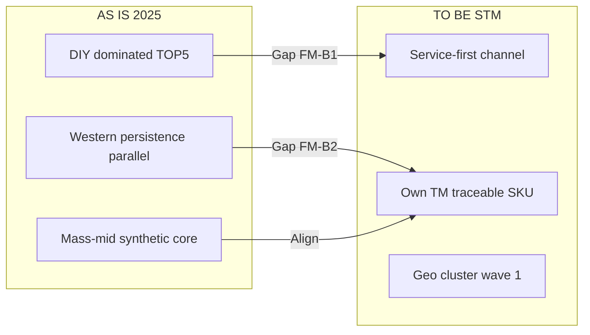
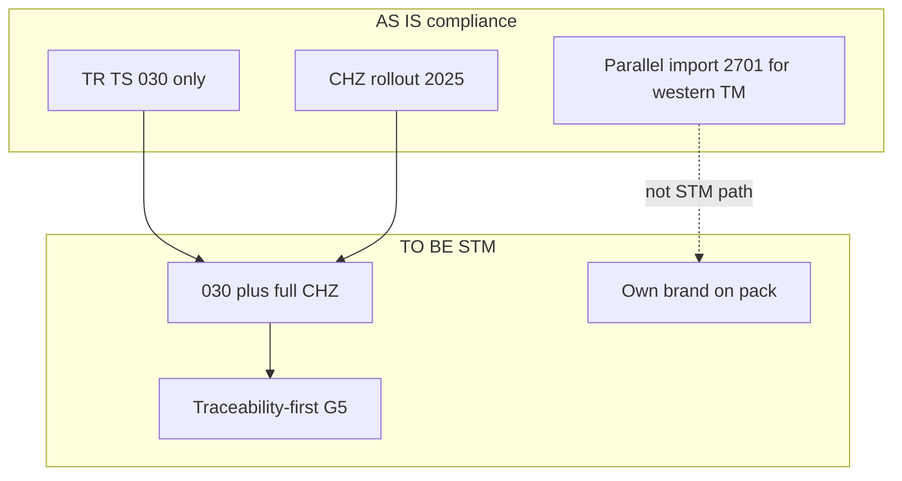

# Декомпозиция DR-A · Инструмент 10: AS IS–TO BE · Задача 1

**Инструмент:** AS IS–TO BE (текущее vs целевое состояние, gap, переход)  
**Основа:** RBS/FMEA (`12_*`), Pareto PC (`11_*`), RC-C, `A_канон_диплом.md` §3.9, §4  
**Дата:** 16.06.2026 · **Статус:** ✅ T1

**Назначение:** зафиксировать **4 контура** «как есть → как должно быть» для главы и проекта СТМ; gap = вход для **Impact Mapping · T1** и F4 §4.

---

## 1. Метод

| Элемент | Правило |
|---------|---------|
| **AS IS** | Verifiable факт + период; ID источника |
| **TO BE** | Целевое состояние **проекта СТМ** (не прогноз рынка) |
| **Gap** | Разрыв, закрываемый **действием** (не новым %) |
| **Transition** | Шаги из Pareto PC + FMEA mitigation |
| **Anti** | TO BE ≠ federal shelf-leadership; ≠ % доли СТМ (R10) |

**Четыре карты (MECE):**

| ID | Контур | § |
|----|--------|---|
| **M1** | Конкурентная структура / каналы | 3.3–3.6, 4.3 |
| **M2** | Compliance (030 + ЧЗ + parallel import) | 3.9, 4.5 |
| **M3** | GTM / модель СТМ | 4.1–4.4 |
| **M4** | Доказательная база главы | 3.1, 3.10 |

---

## 2. M1 — Конкурентная структура и каналы

### 2.1. Три горизонта

| Горизонт | AS IS | ID / MECE |
|----------|-------|-----------|
| **До 2022** | Западные **Operator** = официальная дистрибуция + заводы; retail split запад/RF | D0 baseline |
| **2022–2023** | **Exit** ops; RF/Asia ↑; ценовой шок; Shell 4,5% persistence | S2-01; AS-05; RC-A/B |
| **2024–2025** | Federal brand share **н/д**; NL-01: LUKOIL 1-й synth; DIY ТОП‑5 ~80% | P3; NL-01 |

### 2.2. AS IS vs TO BE (проект СТМ)

| Измерение | AS IS (2025) | TO BE (целевое СТМ) | Gap |
|-----------|--------------|---------------------|-----|
| **Лидерство DIY** | LUKOIL + domestic ТОП‑5 доминируют synthetic | СТМ **не** претендует на №1 полки | Shelf barrier (FM-B1) |
| **Западные марки** | Persistence через parallel import (Shell канистра) | СТМ ≠ «клон Shell/Mobil» | Positioning (FM-B2) |
| **Сегмент** | Synthetic ~60%; premium ₽/л у import | **Mass-mid synthetic** SKU | §4.1 NL-01 |
| **Канал объёма** | DIY + СТО; channel-share **н/д** | **Service-first** (СТО/франшиза) | §4.2 STM-01 |
| **География** | Федеральный рынок; regional brand **н/д** | Волна 1: **ЦФО+СЗФО+ЮФО** | AS-04 |



**Transition M1 (Pareto PC):** PC #1 service → PC #2 segment → §4.3 domestic peers (LUKOIL/SINTEC/Rolf), не premium head-on.

---

## 3. M2 — Compliance-контур

### 3.1. Эволюция (timeline)

| Период | AS IS | TO BE для любого SKU |
|--------|-------|----------------------|
| **≤2024** | 030/2012 baseline; ЧЗ на масла **не** обязателен | — |
| **03–08.2025** | Регистрация участников; добровольная ЧЗ | Подготовка контура |
| **≥01.09.2025** | **Обязательная** ЧЗ импорт **+** РФ | Полная traceability |
| **≥01.12.2025** | Запрет немаркированного оборота | Zero non-compliant SKU |
| **до 31.03.2026** | Маркировка остатков | Закрытие legacy stock |

### 3.2. AS IS vs TO BE

| Элемент | AS IS (до/на 2025) | TO BE (СТМ) | Gap | FMEA |
|---------|-------------------|-------------|-----|------|
| **ТР ТС 030/2012** | Обязателен для всех | Декларация + спеки API/ACEA | — | FM-C3 |
| **Честный ЗНАК** | Вводится 2025; CZ-01: 81/19 ед. | **100%** SKU проекта в контуре | Process + IT | FM-B3, FM-C2 |
| **Parallel import** | № 2701 для **чужих** TM | СТМ = **собственная** TM | Не использовать 506 для СТМ | FM-C1, FM-C4 |
| **Единый контур** | R18: импорт **и** РФ | Traceability-first positioning | §4.5 | FM-B7 |
| **«Серый» статус** | Рынок адаптируется post-shock | **Исключён** из модели СТМ | QA + маркировка | FM-B5 |



**Transition M2:** (1) регистрация в ЧЗ до 01.09.2025; (2) контрактная фасовка с 030; (3) **не** позиционирование как parallel Shell; (4) audit trail для СТО.

---

## 4. M3 — GTM-модель СТМ

### 4.1. AS IS vs TO BE

| Параметр | AS IS (рынок / кейсы) | TO BE (проект) | Эталон |
|----------|----------------------|----------------|--------|
| **Модель** | AGR: service-PB; MZD: dealer-trust | Выбранный паттерн **service-first** или dealer-trust | STM-01, KM-01 |
| **Масштаб** | AGR >500 тыс. л / 6 мес. (**без %**) | Качеств. KPI: литры в сети, **не** federal share | R10 |
| **SKU** | Synthetic mass-mid 5W-30/40 | Линейка под **NL-01** сегмент | §4.1 |
| **Конкуренты** | LUKOIL, SINTEC, Rolf в ТОП‑5 synth | Конкуренция **mass domestic**, не Mobil premium | §4.3 |
| **Цена** | Post-shock stabilization (+2% cat. NL-01) | Value + **compliance**, не race to bottom | NL-01 |
| **Риск** | Shelf-first burn (FM-B1) | **Mitigated:** СТО-first | Pareto PC #1 |

### 4.2. Процесс GTM (упрощённый)

```
AS IS process:
  OEM/Import ops → Distributor → DIY shelf + AZS → Consumer
  (western path broken 2022; RF/Asia fill)

TO BE process (STM):
  Contract filler (030) → CHZ mark → STM TM → Service network → Vehicle owner
                              ↑
                    traceability = differentiator
```

| Шаг | AS IS gap | TO BE action |
|-----|-----------|--------------|
| 1 Product | Нет СТМ SKU | Mass-mid synthetic spec |
| 2 Legal | — | 030 + own TM |
| 3 Marking | Pre-09.2025 optional | CHZ mandatory |
| 4 Channel | DIY blocked | Pilot **300+ СТО** pattern |
| 5 Geo | Federal spray | **ЦФО+СЗФО+ЮФО** |

---

## 5. M4 — Доказательная база главы (исследование)

| Измерение | AS IS (текст диплома сейчас) | TO BE (F4 финал) | Gap |
|-----------|------------------------------|------------------|-----|
| **§3.1–3.8** | 🟡 F4-шаблоны | Final prose + таблицы | Вычитка |
| **§3.9** | ✅ final | Сохранить | — |
| **§3.10** | 🟡 + FM-A list | Таблица FMEA-A | RBS §8 |
| **§4** | 🟡 bullets | AS IS–TO BE M1–M3 narrative | Этот файл |
| **Доли 2024–26** | **н/д** | **н/д** + NL-01 proxy | P3 — не закрывать выдумкой |
| **S2/V1** | Разделены в каноне | Две таблицы в §3.3–3.4 | FM-A1 |

**Transition M4:** GQM row per §; Anti R7–R19 checklist из `06_GQM_T1` §8.

---

## 6. Сводная матрица Gap → Action

| Gap ID | Gap | Action | Pareto / FMEA | § |
|--------|-----|--------|---------------|---|
| **G1** | DIY barrier | Service-first pilot | PC #1; FM-B1 | 4.2 |
| **G2** | Premium clone trap | Own TM mass-mid | PC #2; FM-B2 | 4.1, 4.3 |
| **G3** | CHZ readiness | Register + mark by 09.2025 | PC #3; FM-B3 | 4.5 |
| **G4** | No traceability story | Traceability-first G5 | RC-C | 4.5 |
| **G5** | Federal STM % unknown | KPI liters in network | R10 | 3.9.4 |
| **G6** | Data mixing risk | S2/V1 split tables | FM-A1 | 3.1 |
| **G7** | Geo scatter | Wave-1 cluster | PC #4 | 4.4 |

**Vital few gaps (Pareto):** **G1–G3** = **~80%** transition effort для СТМ.

---

## 7. AS IS–TO BE ↔ артефакты

| Map | RC | ST | Ishikawa | RBS |
|-----|-----|-----|----------|-----|
| M1 | RC-A/B → RC-C | R1, B2, limits | Fishbone 2 | B1, B2 |
| M2 | RC-C leg | B3, leverage 9 | M3 | C1–C4 |
| M3 | RC-C | R4 | M6 | D1–D2 |
| M4 | — | — | — | A1–A4 |

---

## 8. Карта AS IS–TO BE → § диплома

| § | Контент |
|---|---------|
| **3.5** | M1 AS IS 2022 shock (horizon row) |
| **3.6** | M1 persistence AS IS; не TO BE для СТМ |
| **3.9.3** | M2 timeline table |
| **3.9.4** | M3 AS IS кейсы AGR/MZD |
| **§4.1** | M1 TO BE segment |
| **§4.2** | M3 TO BE channel |
| **§4.4** | M1 TO BE geo |
| **§4.5** | M2 TO BE compliance |
| **§4 (введ.)** | Сводный абзац M1–M3 |

**Абзац §4 (AS IS–TO BE, черновик):**  
«**AS IS (2025):** рынок с концентрацией DIY-синтетики у LUKOIL и domestic ТОП‑5, persistence западных канистр через parallel import и переходный compliance-контур с обязательной маркировкой с 01.09.2025. **TO BE проекта СТМ:** traceable mass-mid synthetic в **service-first** канале (паттерн AGR/MZD), собственная TM в едином контуре 030/2012 + «Честный ЗНАК», первая волна — ЦФО, СЗФО и ЮФО, **без** целевой доли на federal DIY-полке (R10).»

---

## 9. Анти-паттерны AS IS–TO BE

| Ошибка | Исправление |
|--------|-------------|
| TO BE = LUKOIL 25% share | R10; R19 |
| AS IS без дат | Всегда период + ID |
| TO BE = «заменим Shell» | FM-B2; FM-C4 |
| Gap closed «10% рынка за 2 года» | No % STM |
| M2: ЧЗ только RF | R18 |
| Один AS IS на 2019 и 2025 | Три горизонта M1 §2.1 |

---

## 10. Выводы AS IS–TO BE · T1

1. **4 карты MECE:** структура, compliance, GTM, данные.  
2. **TO BE СТМ:** service-first + own TM + full CHZ + geo wave 1 — **не** shelf-leadership.  
3. **Vital gaps G1–G3** совпадают с Pareto PC и top FMEA.  
4. M4 фиксирует **F4-долг** §3.1–3.8 vs готовый §3.9.  
5. **T2 (опц.):** swimlane для защиты; **Impact Mapping · T1** — G1–G7 → deliverables.

---

*Следующий инструмент (после одобрения): **Impact Mapping · T1** — ✅ `14_ImpactMapping_T1_карта_влияния.md`.*
