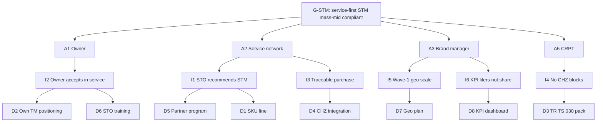

# Декомпозиция DR-A · Инструмент 11: Impact Mapping · Задача 1

**Инструмент:** Impact Mapping (Goal → Actors → Impacts → Deliverables)  
**Основа:** AS IS–TO BE G1–G7 (`13_*`), Pareto PC, GQM G2 / §4, RC-C  
**Дата:** 16.06.2026 · **Статус:** ✅ T1

**Назначение:** связать **цель СТМ** и **цель главы** с **поведением акторов** и **конкретными deliverables**; закрыть gaps G1–G7 без % доли рынка (R10).

---

## 1. Метод

```
        GOAL (зачем)
           │
    ACTORS (кто)
           │
    IMPACTS (какое поведение)
           │
    DELIVERABLES (что делаем)
```

| Правило | Канон |
|---------|-------|
| Один Goal → несколько Actors | MECE по роли, не по бренду |
| Impact = **изменение поведения**, не метрика | KPI liters — deliverable, не impact |
| Deliverable = проверяемый артеfact / процесс | Без «10% рынка» |
| Две карты | **IM-A** GTM СТМ; **IM-B** глава диплома |

---

## 2. IM-A — Impact Map: запуск СТМ (G2, §4)

### 2.1. Goal

**G-STM:** Запустить и масштабировать **СТМ** автомасел **mass-mid synthetic** в РФ через **service-first** канал при **полном compliance** (030 + ЧЗ), используя окно post-2022 **без** цели лидерства на federal DIY-полке.

*Связь:* RC-C, Pareto PC #1–3, AS IS–TO BE M1–M3.

### 2.2. Actors

| ID | Actor | Интерес / роль | Pareto / Gap |
|:--:|-------|----------------|--------------|
| **A1** | **Владелец ТС** | Надёжная замена масла без поиска premium на полке | G2 positioning |
| **A2** | **Сеть СТО / франшиза** | Маржа, repeat, доверие клиента; не DIY-конкуренция | G1; PC #1 |
| **A3** | **Категорийный / бренд-менеджер СТМ** | Запуск SKU, compliance, pilot | G3–G4 |
| **A4** | **Контрактный производитель** | 030, стабильное качество base oil | FM-B5 |
| **A5** | **Регулятор / ЦРПТ** | Прослеживаемость; единый контур импорт+РФ | R18; G3 |
| **A6** | **Конкурент DIY** (LUKOIL, SINTEC) | — | **Не actor цели**; контекст §4.3 |

### 2.3. Impacts (желаемое поведение)

| ID | Actor | Impact (поведение) | Gap |
|:--:|-------|-------------------|-----|
| **I1** | A2 | СТО **рекомендует** СТМ как стандарт SKU в service-замене | G1 |
| **I2** | A1 | Клиент **соглашается** на СТМ в сервисе, не уходит за Shell DIY | G2 |
| **I3** | A2 | Закупка только **промаркированного** SKU через traceable канал | G3, G4 |
| **I4** | A5 | Участник и SKU **без блокировок** в контуре ЧЗ | G3 |
| **I5** | A3 | Масштабирование **волны 1** (ЦФО+СЗФО+ЮФО), не федеральный spray | G7 |
| **I6** | A3 | Учёт успеха в **литрах в сети**, не в federal share | G5 |

### 2.4. Deliverables

| ID | Deliverable | Закрывает Impact | Gap | §4 | ID источника |
|:--:|-------------|------------------|-----|-----|--------------|
| **D1** | Линейка **mass-mid synthetic** (5W-30 / 5W-40, API SP) | I1, I2 | G2 | §4.1 | NL-01 |
| **D2** | **Собственная TM** на канистре; positioning «надёжный RF SKU» | I2 | G2 | §4.3 | Anti FM-B2 |
| **D3** | Пакет **030/2012** (декларация, спеки, маркировка) | I4 | G3 | §4.5 | MK-05 |
| **D4** | Интеграция **«Честный ЗНАК»** (рег. до 01.03.2025; обяз. с 01.09.2025) | I3, I4 | G3, G4 | §4.5 | MK-05 |
| **D5** | **Service partner program** (паттерн AGR: 300+ СТО, контрактная фасовка) | I1 | G1 | §4.2 | STM-01 |
| **D6** | Обучение / POS для СТО (traceability story) | I2, I3 | G4 | §4.5 | G5 |
| **D7** | **Geo wave-1** план: ЦФО 28,6% + СЗФО + ЮФО | I5 | G7 | §4.4 | AS-04 |
| **D8** | **KPI-dashboard**: литры / СТО / SKU (без % рынка) | I6 | G5 | §3.9.4 | R10 |

### 2.5. Диаграмма IM-A



### 2.6. Pareto deliverables (vital few)

| Rank | Deliverable | % усилий (proxy) | PC |
|:----:|-------------|:----------------:|-----|
| 1 | **D5** Partner program | 30% | PC #1 |
| 2 | **D1+D2** SKU + TM | 25% | PC #2 |
| 3 | **D3+D4** Compliance | 25% | PC #3 |
| 4 | D7 Geo | 10% | PC #4 |
| 5 | D6, D8 | 10% | G4, G5 |

**~80%:** D5 + D1/D2 + D3/D4.

---

## 3. IM-B — Impact Map: глава диплома (G1, G3)

### 3.1. Goal

**G-DIP:** Дать **verifiable** описание рынка автомасел РФ 2022–2026 и **обосновать** GTM СТМ для комиссии **без** методологических ошибок.

### 3.2. Actors → Impacts → Deliverables

| Actor | Impact | Deliverable | Gap | § |
|-------|--------|-------------|-----|---|
| **Научрук / комиссия** | Принимает **S2 литры** как лидерство; не ловит R7–R19 | Табл. 3.1 S2; Anti checklist | G6 | 3.3, 3.10 |
| **Читатель** | Понимает **dual root** шока 2022 | §3.5 RC-A/B; Ishikawa PA | — | 3.5 |
| **Читатель** | Не путает import и brand share | §3.6 AS-03 + R8 | — | 3.6 |
| **Комиссия** | Видит **окно СТМ** без % рынка | §4 IM-A summary; AS IS–TO BE | G5 | 4 |
| **Автор** | Защита **н/д** 2024–26 честно | §3.4.1 NL-01 + P3 | — | 3.4.1, 3.10 |

| ID | Deliverable (глава) | F4 статус |
|:--:|---------------------|-----------|
| **B1** | §3.9 compliance final | ✅ |
| **B2** | §3.3–3.4 S2 + V1 p.p. tables | 🟡 |
| **B3** | §3.5 shock + PA vital few | 🟡 |
| **B4** | §3.10 FMEA-A + limitations | 🟡 |
| **B5** | §4 IM-A narrative | 🟡 |
| **B6** | Итоговый абзац §6.4 | ✅ sync |

---

## 4. Склейка Impact ↔ G1–G7

| Gap | Impact(s) | Deliverable(s) | Map |
|-----|-----------|----------------|-----|
| G1 | I1 | D5 | IM-A |
| G2 | I2 | D1, D2 | IM-A |
| G3 | I3, I4 | D3, D4 | IM-A |
| G4 | I2, I3 | D6 | IM-A |
| G5 | I6 | D8 | IM-A |
| G6 | — | B2, B4 | IM-B |
| G7 | I5 | D7 | IM-A |

---

## 5. Impact ↔ артефакты декомпозиции

| Deliverable | Источник анализа |
|-------------|------------------|
| D1–D2 | Pareto PC; Ishikawa Fishbone 2 |
| D3–D4 | §3.9; RBS FM-B3/C2 |
| D5 | STM-01; ST R4 |
| D7 | AS-04; GQM §4.4 |
| B2–B5 | FD T3 F4 path; GQM matrix |
| Positioning | Root Cause RC-C; Anti FM-B2 |

---

## 6. Карта Impact → §4 (структура главы)

| §4 | Impact Map content |
|----|-------------------|
| **§4 (введ.)** | G-STM + AS IS–TO BE one-liner |
| **§4.1** | D1 — segment; I1, I2 |
| **§4.2** | D5 — service; I1 |
| **§4.3** | D2 — vs domestic + persistence context |
| **§4.4** | D7 — geo; I5 |
| **§4.5** | D3, D4, D6 — compliance; I3, I4 |
| **§4.6 (опц.)** | D8 — KPI без R10 |

**Абзац §4.2 (Impact, черновик):**  
«Для изменения поведения **сети СТО** (impact I1) deliverable — **service partner program** по паттерну AGR: контрактная фасовка mass-mid synthetic, подключение СТО к контуру ЧЗ и стандартизация SKU в service-замене; KPI — литры в сети (D8), не federal brand share (R10).»

---

## 7. Анти-паттерны Impact Mapping

| Ошибка | Исправление |
|--------|-------------|
| Deliverable = «занять 5% рынка» | D8 liters; R10 |
| Actor = LUKOIL как «целевой клиент» | A6 контекст; A2 СТО |
| Impact = «LUKOIL 20%» | Поведение, не метрика |
| Один map на GTM + диплом | IM-A / IM-B |
| D2 = «клон Shell дешевле» | FM-B2; D2 own TM |
| Нет actor A5 (регулятор) | G3/G4; R18 |

---

## 8. Выводы Impact Mapping · T1

1. **IM-A:** Goal G-STM → **6 actors** → **6 impacts** → **8 deliverables**; **80%** = D5+D1/D2+D3/D4.  
2. **IM-B:** Goal G-DIP → deliverables B1–B6 для F4 и защиты.  
3. Gaps **G1–G7** полностью покрыты deliverables.  
4. §4 можно писать **по deliverables** D1–D8 (= §4.1–4.5).  
5. **T2 (опц.):** visual map для слайда; **Minto Pyramid · T1** — порядок изложения §4 для комиссии.

---

*Следующий инструмент: **Minto Pyramid · T1** — ✅ `15_MintoPyramid_T1_пирамида_Минто.md`. Цепочка декомпозиции закрыта.*
