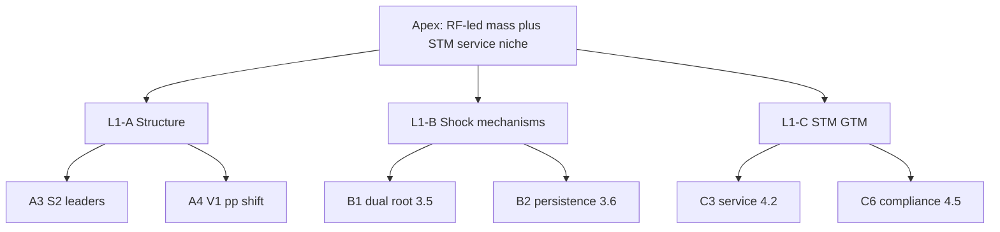

# Декомпозиция DR-A · Инструмент 12: Minto Pyramid · Задача 1

**Инструмент:** Minto Pyramid (пирамида Минто: SCQA, answer-first, MECE-группировка)  
**Основа:** Impact Map D1–D8 (`14_*`), MECE §6.4, GQM G1–G3, `A_канон_диплом.md`  
**Дата:** 16.06.2026 · **Статус:** ✅ T1 · **Одобрено автором:** 16.06.2026 · **Финал цепочки декомпозиции**

**Назначение:** задать **порядок изложения** главы §3–§4 и **речи на защите** — сверху вниз: главный ответ → аргументы → доказательства.

---

## 1. Метод

| Элемент | Правило |
|---------|---------|
| **SCQA** | Situation → Complication → Question → **Answer** (верх пирамиды) |
| **Answer-first** | Первое предложение § = вывод, не метод |
| **MECE-ветки** | 3–5 групп аргументов без пересечений |
| **Vertical logic** | Каждый §3.x = доказательство к ветке L1 |
| **Horizontal logic** | Внутри ветки — хронология или структура «что → почему → следствие» |

**Три пирамиды (MECE):**

| ID | Аудитория | Объект |
|----|-----------|--------|
| **P0** | Комиссия | **Вся глава** §3 + §4 |
| **P1** | Комиссия | **§3** — рынок |
| **P2** | Комиссия | **§4** — СТМ |

---

## 2. P0 — SCQA всей главы

| | Текст |
|---|-------|
| **S** (Situation) | Рынок автомасел РФ (легковые+LCV) — **278 млн л** retail (2023); лидерство считается в **литрах** (S2). |
| **C** (Complication) | Шок **2022**: exit западных ops + цены **+110%/+124%**; структура сместилась к RF/Asia; западные канистры **сохраняются** (parallel import); с **2025** — обязательная **ЧЗ**; federal share **2024–26 — н/д**. |
| **Q** (Question) | Какова **конкурентная структура** и **есть ли обоснованное окно** для СТМ mass-mid synthetic? |
| **A** (Answer) | **LUKOIL-led RF mass** (S2 2023) + **service-first traceable СТМ** в synthetic ~60% — **без** цели №1 на DIY-полке. |

**Главный тезис (apex, 1 предложение):**  
«После структурного шока 2022 г. retail-лидерство в литрах принадлежит российским маркам (LUKOIL **18,1%**, тройка **37,1%**), а для СТМ открывается ниша **mass-mid synthetic** в **service-first** канале при **едином compliance** 030/2012 + «Честный ЗНАК», а не конкуренция с premium-import на полке.»

---

## 3. P0 — пирамида L0 → L1 → L2

```
                    [APEX] Answer P0
                           │
        ┌──────────────────┼──────────────────┐
        │                  │                  │
   [L1-A] Структура    [L1-B] Шок &        [L1-C] Окно &
         рынка 2023         динамика            GTM СТМ
        │                  │                  │
   §3.1–3.4, 3.7      §3.5–3.6           §3.9, §4
   §3.4.1, 3.10       3.8 (geo)          D1–D8
```

### L1-A — Структура рынка (что есть сейчас)

| L2 | Key message | § | ID |
|----|-------------|---|-----|
| A1 | Метод: **S2 = уровень**, **V1 = p.p. only** | 3.1 | S2-01, V1-01 |
| A2 | Масштаб: **278 млн л** / 196 млрд ₽ | 3.2 | S2-01 |
| A3 | Лидеры: LUKOIL **18,1%** л; тройка **37,1%** | 3.3 | S2-01 |
| A4 | Сдвиг: Shell **−6,1** p.p.; LUKOIL **+1,9**; ZIC **+2,4** | 3.4 | V1-01 |
| A5 | 2024–25: federal **н/д**; NL-01 LUKOIL 1-й synth | 3.4.1 | NL-01 |
| A6 | Synthetic **~60%** — ядро категории | 3.7 | NL-01 |

### L1-B — Шок и механизмы (почему так)

| L2 | Key message | § | RC / PA |
|----|-------------|---|---------|
| B1 | **Dual root:** exit ops (RC-A) + price shock (RC-B) | 3.5 | AS-05, D0 |
| B2 | **Persistence:** parallel import ≠ 0% Shell | 3.6 | № 2701, AS-03 |
| B3 | Import **≠** retail share; CZ-01 **≠** brand share | 3.6 | R8, R19 |
| B4 | Geo proxy: **ЦФО+СЗФО+ЮФО ≈49%** парка | 3.8 | AS-04 |
| B5 | Ограничения: **н/д** 2024–26; Anti R7–R19 | 3.10 | P3 |

### L1-C — Окно и GTM СТМ (что делать)

| L2 | Key message | § | Deliverable |
|----|-------------|---|-------------|
| C1 | Compliance: 030 + ЧЗ **импорт+РФ** | 3.9 | D3, D4 |
| C2 | Сегмент: **mass-mid synthetic** | 4.1 | D1 |
| C3 | Канал: **service-first** (AGR) | 4.2 | D5 |
| C4 | Конкуренты: domestic synth, не Shell clone | 4.3 | D2 |
| C5 | Geo wave-1 | 4.4 | D7 |
| C6 | **Traceability-first** | 4.5 | D6 |



---

## 4. P1 — §3 только (рынок, без GTM)

**Answer §3:** «Структура retail 2023 и направление сдвига после 2022 **verifiable** на S2/V1; persistence западных марок **не противоречит** росту RF/Asia.»

**SCQA §3:**

| | |
|---|---|
| S | Категория ~278 млн л; две базы S2/V1 |
| C | Exit 2022; dual root; gaps 2024–26 |
| Q | Кто лидирует и как изменилась структура? |
| A | LUKOIL-led тройка 37,1% л + V1 p.p. + persistence |

**Порядок чтения §3 (Minto flow):**

```
3.1 метод → 3.2 масштаб → 3.3 уровень (S2) → 3.4 направление (V1 p.p.)
    → 3.5 почему (шок) → 3.6 импорт/persistence → 3.7 сегмент
    → 3.4.1 proxy 2024–25 → 3.8 geo → 3.9 регуляторика → 3.10 limits
```

*Логика:* **что** (3.3) → **куда** (3.4) → **почему** (3.5–3.6) → **контекст** (3.7–3.8) → **продолжение/ограничения** (3.4.1, 3.10); **3.9** — мост к §4.

---

## 5. P2 — §4 только (импликации СТМ)

**Answer §4:** «СТМ — **service-first**, **mass-mid synthetic**, **traceable**; KPI — **литры в сети**, не federal share.»

**SCQA §4:**

| | |
|---|---|
| S | DIY ТОП‑5 ~80% synth; AGR/MZD доказали service scale |
| C | Shelf barrier + western persistence + ЧЗ 2025 |
| Q | Как войти без лобовой полки? |
| A | D5 partner program + D1/D2 SKU + D3/D4 compliance + D7 geo |

**Пирамида §4 (MECE 5 веток = GQM §4):**

| §4 | Key message (topic sentence) | D |
|----|------------------------------|---|
| **4.1** | Объём в **mass-mid synthetic** (~60%), не premium | D1 |
| **4.2** | Первый канал — **СТО**, не DIY | D5 |
| **4.3** | Конкуренты — **LUKOIL/SINTEC/Rolf**; не «замена Shell» | D2 |
| **4.4** | Волна 1: **ЦФО+СЗФО+ЮФО** | D7 |
| **4.5** | Дифференциатор — **030 + ЧЗ**, traceability | D3–D6 |

**Topic sentence §4 (введение, answer-first):**  
«Импликации для СТМ следуют из структуры рынка: при концентрации DIY-синтетики у федеральных лидеров проект фокусируется на **service-first** масштабировании **mass-mid synthetic** SKU с **полной прослеживаемостью** с 01.09.2025.»

---

## 6. Защита: порядок слайдов (10–12 min)

| # | Слайд | Pyramid node | Время |
|---|-------|--------------|-------|
| 1 | SCQA + **Apex** | P0 Answer | 1 min |
| 2 | Метод S2/V1 | A1 | 1 min |
| 3 | Табл. лидеров S2 2023 | A3 | 1.5 min |
| 4 | V1 p.p. + dual root | A4, B1 | 1.5 min |
| 5 | Persistence + CZ-01 (не brand!) | B2, B3 | 1 min |
| 6 | Synthetic ~60% | A6 | 0.5 min |
| 7 | Compliance 3.9 | C1 | 1 min |
| 8 | **§4 pyramid** D5→D1→D3 | C2–C6 | 2 min |
| 9 | Limitations 3.10 | B5 | 1 min |
| 10 | Q&A | — | — |

**Elevator pitch (30 сек):** формула MECE §6.4 + одна фраза §4 topic sentence.

---

## 7. Minto ↔ декомпозиция (полная цепочка)

```
MECE A–G
  → FD F1–F5
    → GQM Q→M
      → ER entities
        → ST loops
          → Ishikawa 6M
            → Root Cause RC-A/B/C
              → Pareto PA/PB/PC
                → RBS/FMEA
                  → AS IS–TO BE
                    → Impact D1–D8
                      → Minto P0/P1/P2  ← вы здесь
```

| Инструмент | Слой Minto |
|------------|------------|
| MECE §6.4 | Apex + A3, A4 |
| Root Cause | B1 (§3.5) |
| Pareto PA | B1 ordering |
| Pareto PC | C2–C6 (§4) |
| Impact Map | §4 structure |
| FMEA FM-A | B5 (§3.10) |
| AS IS–TO BE | SCQA Situation/Complication |

---

## 8. Карта Minto → файлы F4

| Pyramid | Файл для вычитки |
|---------|------------------|
| Apex, P1 | `A_канon_диплом.md` итоговый абзац |
| L1-A | §3.1–3.4, 3.4.1, 3.7 |
| L1-B | §3.5–3.6, 3.8, 3.10 |
| L1-C | §3.9, §4.1–4.5 |
| Anti | `06_GQM_T1` §8 |
| Defense | Этот файл §6 |

---

## 9. Анти-паттерны Minto

| Ошибка | Исправление |
|--------|-------------|
| §3 начинается с «были проведены исследования…» | Answer-first §3 SCQA |
| §4 перед §3.3 | P0: структура → шок → GTM |
| Apex = «СТМ займёт X%» | R10; D8 liters |
| 3.6 перед 3.5 | B1 before B2 detail OK, но **3.5 before 3.6** в narrative |
| CZ-01 в Apex | R19; только B3 |
| 15 равноправных § без групп | L1-A/B/C |

---

## 10. Выводы Minto Pyramid · T1

1. **P0 Apex** — одна формула для введения, заключения §3 и pitch.  
2. **P1** задаёт **reading order** §3.1–3.10 (3.9 — мост).  
3. **P2** = **§4.1–4.5** one-to-one с Impact D1–D8.  
4. **SCQA** готов для доклада; слайды §6.  
5. **Цепочка декомпозиции DR-A закрыта** (MECE → … → Minto). **Следующий шаг проекта:** F4-вычитка `A_канon_диплом.md` по L1-A/B/C.

---

*Декомпозиция DR-A · инструменты 1–12 ✅. Рекомендация: **F4-вычитка** §3.1–3.8, 3.10 + написание §4 по P2.*
